When and why people think beliefs are "debunked" by scientific explanations of their origins
================

Dillon Plunkett, Lara Buchak, Tania Lombrozo

September 21, 2018

-   [Setup](#setup)
-   [Experiment 1](#experiment-1)
    -   [Participants](#participants)
    -   [Distribution and Means](#distribution-and-means)
    -   [Plot for Paper](#plot-for-paper)
    -   [ANOVAs](#anovas)
    -   [Belief Reinforcement/Undermining](#belief-reinforcementundermining)
    -   [Verify Perceived Prevalence](#verify-perceived-prevalence)
-   [Experiment 2](#experiment-2)
    -   [Participants](#participants-1)
    -   [Distribution and Means](#distribution-and-means-1)
    -   [Plot for Paper](#plot-for-paper-1)
    -   [ANOVAs](#anovas-1)
    -   [Belief Reinforcement/Undermining](#belief-reinforcementundermining-1)
-   [Experiment 3](#experiment-3)
    -   [Participants](#participants-2)
    -   [Distribution and Means](#distribution-and-means-2)
    -   [Plot for Paper](#plot-for-paper-2)
    -   [ANOVAs](#anovas-2)
    -   [Belief Reinforcement/Undermining](#belief-reinforcementundermining-2)
    -   [First-Person Judgments](#first-person-judgments)
-   [Experiment 4](#experiment-4)
    -   [Participants](#participants-3)
    -   [Distribution and Means](#distribution-and-means-3)
    -   [Plot for Paper](#plot-for-paper-3)
    -   [ANOVAs](#anovas-3)
    -   [Belief Reinforcement/Undermining](#belief-reinforcementundermining-3)
    -   [Confirm Scenarios Are Plausible and Realistic](#confirm-scenarios-are-plausible-and-realistic)
-   [Experiment 5](#experiment-5)
    -   [Participants](#participants-4)
    -   [Distribution and Means](#distribution-and-means-4)
    -   [Plot for Paper](#plot-for-paper-4)
    -   [ANOVA](#anova)
    -   [Scale Items](#scale-items)
-   [Supplementary Experiment](#supplementary-experiment)
    -   [Participants](#participants-5)
    -   [Distribution and Means](#distribution-and-means-5)
    -   [Plot for Paper](#plot-for-paper-5)
    -   [ANOVAs](#anovas-4)
    -   [Belief Reinforcement/Undermining](#belief-reinforcementundermining-4)
    -   [First-Person Judgments](#first-person-judgments-1)

Setup
=====

Load exact versions of packages used in reported analyses.

``` r
if (!require(checkpoint, quietly = TRUE))  {
  install.packages("checkpoint")
  require(checkpoint)
}
checkpoint("2018-09-21")
library(tidyverse)
library(magrittr)
library(broom)
library(car)
library(heplots)
library(WRS2)
library(dae)
library(ez)
library(knitr)

op <- options(contrasts = c("contr.sum", "contr.poly"))
```

These two plotting functions are used throughout.

``` r
vio_dot <- function(data, y, x, color = NULL, dotsize = 0.4) {
  data %>%
    ggplot(aes_string(y = y, x = x, color = color)) +
    geom_violin() +
    geom_dotplot(
      aes_string(fill = color),
      position="dodge",
      binaxis = "y", stackdir = "center", binwidth = 0.2,
      dotsize = dotsize
    )
}
paper_plot <- function(data, y, x, x_lab, color, color_lab, ylim, dodge) {
  data %>%
    ggplot(aes_string(x = x, y = y, color = color)) +
    geom_hline(yintercept = 0) +
    geom_pointrange(
      stat = "summary",
      fun.data = mean_se,
      position = position_dodge(dodge)
    ) +
    geom_errorbar(
      stat = "summary",
      fun.data = mean_se,
      position = position_dodge(dodge),
      width = 0.1,
      show.legend = FALSE
    ) +
    scale_color_grey(name = color_lab, labels = str_to_title) +
    scale_x_discrete(name = x_lab, labels = str_to_title) +
    coord_cartesian(ylim = ylim) +
    labs(y = "Suggested Change in Confidence") +
    theme_classic() +
    theme(
      legend.position = "top",
      axis.line.x = element_blank(),
      axis.ticks.x = element_blank()
    )
}
```

ANOVA with *η*<sup>2</sup>

``` r
ANOVA <- function(lm) {
  lm %>%
    Anova(type = "III") %>%
    tidy() %>%
    slice(-1) %>%  # Drop intercept.
    bind_cols(etasq(lm))
}
```

Experiment 1
============

Load data.

``` r
exp1_raw <- read_csv("data/experiment1_data.csv")
exp1_data <-
  exp1_raw %>%
  select(
    participant_id = ResponseId,
    consent = Q1,
    michael_should = Q20, you_should = Q22,
    michael_would = Q100, you_would = Q14,
    germ_theory = Q101_1_1, evolution = Q101_3_1, god = Q101_5_1,
    soulmate = Q101_7_1, murder_wrong = Q101_9_1, vegetarianism = Q101_11_1,
    attention_check = Q13_9_TEXT, done_before = Q106,
    sex = Q81, age = Q82,
    valence = AcceptReject, domain = SciRelMor, prevalence = CommonRare,
    own_belief = TargetRating,
    condition = FalseNeutralTrue
  ) %>%
  # Drop extra header rows.
  slice(-1:-2) %>%
  type_convert() %>%
  # Center Likerts at 0.
  mutate_at(
    vars(contains("should"), contains("would"), own_belief),
    funs(. - 4)
  ) %>%
  mutate(
    agrees_with_michael = own_belief > 0,
    common_avg = (germ_theory + god + murder_wrong) / 3,
    rare_avg = (evolution + soulmate + vegetarianism) / 3,
    consent = consent %>%
      recode_factor("2" = "consent", "1" = "no_consent"),
    done_before = done_before %>%
      recode_factor("1" = "yes", "2" = "maybe", "3" = "no"),
    sex = sex %>%
      recode_factor("1" = "male", "2" = "female", "3" = "other"),
    domain = domain %>%
      recode_factor("1" = "scientific", "2" = "religious", "3" = "moral"),
    prevalence = prevalence %>%
      recode_factor("1" = "common", "2" = "rare"),
    condition = condition %>%
      recode_factor(
        "True" = "reliable",
        "Neutral" = "neutral",
        "False" = "unreliable"
      ),
    pass_check = grepl("dax", attention_check, ignore.case = TRUE)
  ) %>%
  mutate_at(
    vars(contains("you_")),
    funs(. * if_else(agrees_with_michael, 1, -1))
  )
```

Participants
------------

10 participants didn't complete the experiment. Another 17 participants think they might have done a similar study before. 22 of the rest missed a catch question. Analyses will focus on data from the remaining 173 participants.

``` r
exp1_data %>%
  filter(consent == "consent") %>%
  # Don't count leaving attention check blank as not finishing, just as wrong.
  select(-attention_check) %>%
  count(complete.cases(.), done_before, pass_check)
exp1_included <-
  exp1_data %>%
  drop_na() %>%
  filter(done_before == "no", pass_check)
```

| complete.cases(.) | done\_before | pass\_check |    n|
|:------------------|:-------------|:------------|----:|
| FALSE             | no           | TRUE        |    1|
| FALSE             | NA           | FALSE       |    8|
| FALSE             | NA           | TRUE        |    1|
| TRUE              | yes          | FALSE       |    1|
| TRUE              | yes          | TRUE        |    6|
| TRUE              | maybe        | FALSE       |    2|
| TRUE              | maybe        | TRUE        |    8|
| TRUE              | no           | FALSE       |   22|
| TRUE              | no           | TRUE        |  173|

### Demographics

``` r
exp1_included %>% select(sex, age) %>% summary() %>% kable()
```

|     |     sex    |      age     |
|-----|:----------:|:------------:|
|     |  male :101 |  Min. :18.0  |
|     | female: 72 | 1st Qu.:24.0 |
|     |            | Median :29.0 |
|     |            |  Mean :32.4  |
|     |            | 3rd Qu.:36.0 |
|     |            |  Max. :67.0  |

### Inclusion/exclusion by conditions

``` r
exp1_included %>% count(condition, prevalence) %>% spread(prevalence, n)
```

| condition  |  common|  rare|
|:-----------|-------:|-----:|
| reliable   |      31|    25|
| neutral    |      27|    32|
| unreliable |      29|    29|

Distribution and Means
----------------------

``` r
exp1_included %>% vio_dot("michael_should", "condition", "prevalence")
```

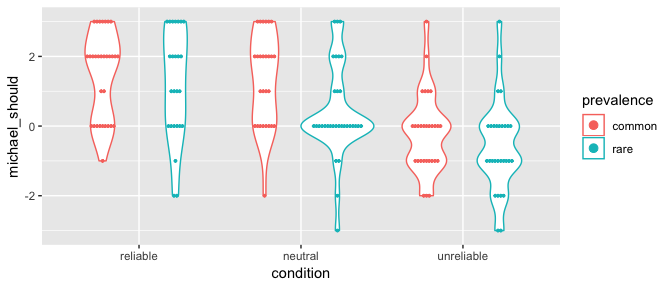

``` r
exp1_included %>% vio_dot("michael_would", "condition", "prevalence")
```

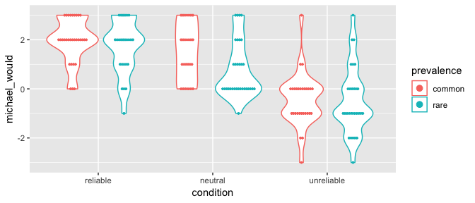

### Group means

Reliable mechanisms are taken to support belief, as are neutral explanations (only somewhat less strongly), while unreliable mechanisms are taken to undermine belief. This is consistent across common and rare target beliefs, and also seen in predictive judgments (about what people would do). Values are overall higher for common target beliefs.

``` r
exp1_included %$%
  tapply(michael_should, list(condition, prevalence), mean) %>%
  kable()
```

|            |   common|     rare|
|------------|--------:|--------:|
| reliable   |   1.4839|   1.2000|
| neutral    |   1.3333|   0.4062|
| unreliable |  -0.2069|  -0.5862|

``` r
exp1_included %$%
  tapply(michael_would, list(condition, prevalence), mean) %>%
  kable()
```

|            |   common|     rare|
|------------|--------:|--------:|
| reliable   |   1.9677|   1.6800|
| neutral    |   1.5185|   0.7812|
| unreliable |  -0.4483|  -0.4828|

Things are qualitatively the same across domains, except that people don't say unreliable mechanisms should undermine moral beliefs (mean response lower than for neutral explanations, but still slightly positive).

``` r
exp1_included %$%
  tapply(michael_should, list(condition, domain), mean) %>%
  kable()
```

|            |  scientific|  religious|   moral|
|------------|-----------:|----------:|-------:|
| reliable   |      1.5714|     1.0588|  1.3889|
| neutral    |      1.1579|     0.5263|  0.8095|
| unreliable |     -0.5789|    -0.7895|  0.1500|

``` r
exp1_included %$%
  tapply(michael_would, list(condition, domain), mean) %>%
  kable()
```

|            |  scientific|  religious|   moral|
|------------|-----------:|----------:|-------:|
| reliable   |      1.6190|     1.7647|   2.167|
| neutral    |      1.0000|     1.0526|   1.286|
| unreliable |     -0.6316|    -0.4211|  -0.350|

The main effect of prevalence is also consistent across domains.

``` r
exp1_included %$%
  tapply(michael_should, list(prevalence, domain), mean) %>%
  kable()
```

|        |  scientific|  religious|   moral|
|--------|-----------:|----------:|-------:|
| common |      0.8438|     0.6923|  1.0690|
| rare   |      0.6296|    -0.1724|  0.4667|

``` r
exp1_included %$%
  tapply(michael_would, list(prevalence, domain), mean) %>%
  kable()
```

|        |  scientific|  religious|   moral|
|--------|-----------:|----------:|-------:|
| common |      0.7188|     1.2692|  1.1379|
| rare   |      0.6667|     0.3103|  0.8667|

Plot for Paper
--------------

``` r
exp1_included %>%
  paper_plot(
    y = "michael_should",
    x = "domain", x_lab = "Belief Domain",
    color = "condition", color_lab = "Epistemic Condition",
    ylim = c(-1, 2), dodge = 0.25
  )
```

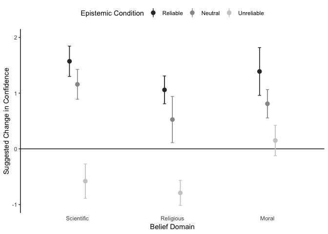

ANOVAs
------

Main effects of epistemic condition and claim prevalence, no interaction. All pairwise differences between epistemic conditions are significant.

``` r
exp1_should_lm <- exp1_included %$% lm(michael_should ~ condition * prevalence)
ANOVA(exp1_should_lm)
```

| term                 |    sumsq|   df|  statistic|  p.value|  Partial eta^2|
|:---------------------|--------:|----:|----------:|--------:|--------------:|
| condition            |   92.332|    2|    26.2902|   0.0000|         0.2369|
| prevalence           |   12.071|    1|     6.8739|   0.0096|         0.0403|
| condition:prevalence |    3.475|    2|     0.9896|   0.3739|         0.0117|
| Residuals            |  293.254|  167|           |         |               |

``` r
exp1_included %$% pairwise.t.test(michael_should, condition, "holm")
```

    ##
    ##  Pairwise comparisons using t tests with pooled SD
    ##
    ## data:  michael_should and condition
    ##
    ##            reliable neutral
    ## neutral    0.04     -
    ## unreliable 2e-10    4e-06
    ##
    ## P value adjustment method: holm

An analogous ANOVA analyzing the predictive judgments (about what the subject of the vignette *would* do, as opposed to what he *should* do) finds the same effects.

``` r
exp1_would_lm <- exp1_included %$% lm(michael_would ~ condition * prevalence)
ANOVA(exp1_would_lm)
```

| term                 |    sumsq|   df|  statistic|  p.value|  Partial eta^2|
|:---------------------|--------:|----:|----------:|--------:|--------------:|
| condition            |  158.008|    2|     61.357|   0.0000|         0.4229|
| prevalence           |    5.358|    1|      4.161|   0.0429|         0.0246|
| condition:prevalence |    3.692|    2|      1.434|   0.2413|         0.0169|
| Residuals            |  215.031|  167|           |         |               |

``` r
exp1_included %$% pairwise.t.test(michael_would, condition, "holm")
```

    ##
    ##  Pairwise comparisons using t tests with pooled SD
    ##
    ## data:  michael_would and condition
    ##
    ##            reliable neutral
    ## neutral    9e-04    -
    ## unreliable <2e-16   8e-12
    ##
    ## P value adjustment method: holm

### Check assumptions for ANOVAs

Shapiro-Wilk test is significant, but the results are the same using a robust test, and previous visualization didn't suggest any issues with using the mean as a summary statistic.

``` r
exp1_included %$% leveneTest(michael_should ~ condition * prevalence)
```

|       |   Df|  F value|  Pr(&gt;F)|
|-------|----:|--------:|----------:|
| group |    5|    1.021|      0.407|
|       |  167|         |           |

``` r
exp1_included %$% leveneTest(michael_would ~ condition * prevalence)
```

|       |   Df|  F value|  Pr(&gt;F)|
|-------|----:|--------:|----------:|
| group |    5|   0.7915|     0.5572|
|       |  167|         |           |

``` r
exp1_should_lm %>% residuals() %>% shapiro.test()
```

    ##
    ##  Shapiro-Wilk normality test
    ##
    ## data:  .
    ## W = 0.98, p-value = 0.02

``` r
exp1_would_lm %>% residuals() %>% shapiro.test()
```

    ##
    ##  Shapiro-Wilk normality test
    ##
    ## data:  .
    ## W = 0.98, p-value = 0.005

``` r
exp1_included %$% t2way(michael_should ~ condition * prevalence)
```

    ## Call:
    ## t2way(formula = michael_should ~ condition * prevalence)
    ##
    ##                       value p.value
    ## condition            45.685   0.001
    ## prevalence            4.368   0.040
    ## condition:prevalence  2.540   0.293

``` r
exp1_included %$% t2way(michael_would ~ condition * prevalence)
```

    ## Call:
    ## t2way(formula = michael_would ~ condition * prevalence)
    ##
    ##                        value p.value
    ## condition            111.956   0.001
    ## prevalence             5.356   0.024
    ## condition:prevalence   2.703   0.272

Belief Reinforcement/Undermining
--------------------------------

``` r
exp1_included %>%
  group_by(condition) %>%
  summarise(
    michael_should = mean(michael_should),
    michael_would = mean(michael_would)
  )
```

| condition  |  michael\_should|  michael\_would|
|:-----------|----------------:|---------------:|
| reliable   |           1.3571|          1.8393|
| neutral    |           0.8305|          1.1186|
| unreliable |          -0.3966|         -0.4655|

Tests against the scale midpoint confirm reinforcement for reliable and neutral mechanisms, undermining for unreliable mechanisms.

``` r
exp1_included %>%
  group_by(condition) %>%
  do(tidy(t.test(.$michael_should))) %>%
  select(-c(method, alternative))
```

| condition  |  estimate|  statistic|  p.value|  parameter|  conf.low|  conf.high|
|:-----------|---------:|----------:|--------:|----------:|---------:|----------:|
| reliable   |    1.3571|      7.286|   0.0000|         55|    0.9839|     1.7304|
| neutral    |    0.8305|      4.544|   0.0000|         58|    0.4647|     1.1964|
| unreliable |   -0.3966|     -2.432|   0.0182|         57|   -0.7230|    -0.0701|

``` r
exp1_included %>%
  group_by(condition) %>%
  do(tidy(t.test(.$michael_would))) %>%
  select(-c(method, alternative))
```

| condition  |  estimate|  statistic|  p.value|  parameter|  conf.low|  conf.high|
|:-----------|---------:|----------:|--------:|----------:|---------:|----------:|
| reliable   |    1.8393|     13.695|   0.0000|         55|    1.5701|     2.1084|
| neutral    |    1.1186|      7.219|   0.0000|         58|    0.8085|     1.4288|
| unreliable |   -0.4655|     -2.879|   0.0056|         57|   -0.7893|    -0.1417|

Verify Perceived Prevalence
---------------------------

The "common" beliefs are indeed perceived to be more prevalent than the "rare" beliefs.

``` r
exp1_included %>%
  select(germ_theory:vegetarianism) %>%
  summarize_all(funs(mean))
```

|  germ\_theory|  evolution|    god|  soulmate|  murder\_wrong|  vegetarianism|
|-------------:|----------:|------:|---------:|--------------:|--------------:|
|         85.54|      55.71|  67.14|     51.14|          91.78|          24.08|

``` r
exp1_included %$% t.test(common_avg, rare_avg, paired = TRUE)
```

    ##
    ##  Paired t-test
    ##
    ## data:  common_avg and rare_avg
    ## t = 30, df = 170, p-value <2e-16
    ## alternative hypothesis: true difference in means is not equal to 0
    ## 95 percent confidence interval:
    ##  35.34 40.35
    ## sample estimates:
    ## mean of the differences
    ##                   37.85

Experiment 2
============

Load data.

``` r
exp2_raw <- read_csv("data/experiment2_data.csv")
exp2_data <-
  exp2_raw %>%
  select(
    participant_id = ResponseId,
    consent = Q1,
    michael_would = Q100, you_would = Q14,
    michael_should = Q14_1, you_should = Q17,
    attention_check = Q13_9_TEXT, done_before = Q106,
    sex = Q81, age = Q82,
    valence = AcceptReject, domain = SciRelMor, prevalence = CommonRare,
    condition = NormallyAbnormally
  ) %>%
  # Drop extra header rows.
  slice(-1:-2) %>%
  type_convert() %>%
  # Center Likerts at 0.
  mutate_at(
    vars(contains("should"), contains("would")),
    funs(. - 4)
  ) %>%
  mutate(
    consent = consent %>%
      recode_factor("2" = "consent", "1" = "no_consent"),
    done_before = done_before %>%
      recode_factor("1" = "yes", "2" = "maybe", "3" = "no"),
    sex = sex %>%
      recode_factor("1" = "male", "2" = "female", "3" = "other"),
    domain = domain %>%
      recode_factor("1" = "scientific", "2" = "religious", "3" = "moral"),
    prevalence = prevalence %>%
      recode_factor("1" = "common", "2" = "rare"),
    condition = condition %>%
      recode_factor("normally" = "normal", "abnormally" = "abnormal"),
    pass_check = grepl("dax", attention_check, ignore.case = TRUE)
  )
```

Participants
------------

7 participants didn't complete the experiment. Another 7 participants think they might have done a similar study before. 4 of the rest missed a catch question. Analyses will focus on data from the remaining 107 participants.

``` r
exp2_data %>%
  filter(consent == "consent") %>%
  # Don't count leaving attention check blank as not finishing, just as wrong.
  select(-attention_check) %>%
  count(complete.cases(.), done_before, pass_check)
exp2_included <-
  exp2_data %>%
  drop_na() %>%
  filter(done_before == "no", pass_check)
```

| complete.cases(.) | done\_before | pass\_check |    n|
|:------------------|:-------------|:------------|----:|
| FALSE             | no           | TRUE        |    2|
| FALSE             |              | FALSE       |    5|
| TRUE              | yes          | TRUE        |    2|
| TRUE              | maybe        | TRUE        |    5|
| TRUE              | no           | FALSE       |    4|
| TRUE              | no           | TRUE        |  107|

### Demographics

``` r
exp2_included %>% select(sex, age) %>% summary() %>% kable()
```

|     |    sex    |     age    |
|-----|:---------:|:----------:|
|     |  male :67 |  Min. :18  |
|     | female:40 | 1st Qu.:24 |
|     |           | Median :28 |
|     |           |  Mean :32  |
|     |           | 3rd Qu.:36 |
|     |           |  Max. :73  |

### Inclusion/exclusion by conditions

``` r
exp2_included %>% count(condition, prevalence) %>% spread(prevalence, n)
```

| condition |  common|  rare|
|:----------|-------:|-----:|
| normal    |      27|    28|
| abnormal  |      28|    24|

Distribution and Means
----------------------

``` r
exp2_included %>% vio_dot("michael_should", "condition", "prevalence")
```

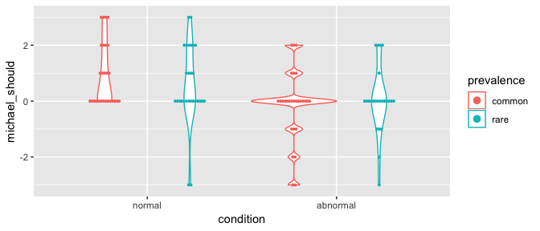

``` r
exp2_included %>% vio_dot("michael_would", "condition", "prevalence")
```

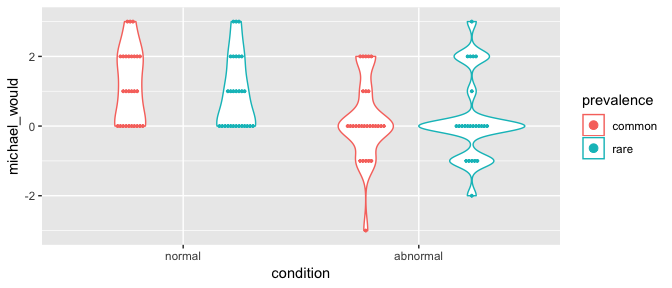

### Group means

Association with a normal mechanism, but not an abnormal mechanism, seems to be taken as support for a belief. This is consistent across common and rare beliefs. No evidence of a main effect of belief prevalence in this sample.

``` r
exp2_included %$%
  tapply(michael_should, list(condition, prevalence), mean) %>%
  kable()
```

|          |   common|    rare|
|----------|--------:|-------:|
| normal   |   0.9259|  0.5714|
| abnormal |  -0.1429|  0.0417|

``` r
exp2_included %$%
  tapply(michael_would, list(condition, prevalence), mean) %>%
  kable()
```

|          |  common|    rare|
|----------|-------:|-------:|
| normal   |  1.1481|  0.9286|
| abnormal |  0.1786|  0.2083|

The same qualitative pattern is seen across belief domains.

``` r
exp2_included %$%
  tapply(michael_should, list(condition, domain), mean) %>%
  kable()
```

|          |  scientific|  religious|   moral|
|----------|-----------:|----------:|-------:|
| normal   |      0.7917|     0.5714|  0.8235|
| abnormal |      0.0000|    -0.3500|  0.2353|

``` r
exp2_included %$%
  tapply(michael_would, list(condition, domain), mean) %>%
  kable()
```

|          |  scientific|  religious|   moral|
|----------|-----------:|----------:|-------:|
| normal   |       1.167|     0.9286|  0.9412|
| abnormal |       0.200|     0.3000|  0.0588|

Plot for Paper
--------------

``` r
exp2_included %>%
  paper_plot(
    y = "michael_should",
    x = "domain", x_lab = "Belief Domain",
    color = "condition", color_lab = "Mechanism Type",
    ylim = c(-0.75, 1.25), dodge = 0.5
  )
```

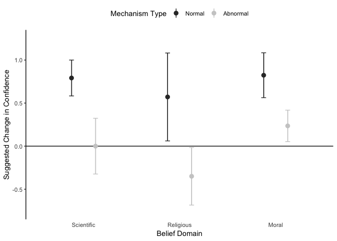

ANOVAs
------

Main effect of the type of mechanism associated with the target belief (normal/abnormal). No effect of prevalence of the target belief and no interaction.

``` r
exp2_should_lm <-
  exp2_included %$% lm(michael_should ~ condition * prevalence)
ANOVA(exp2_should_lm)
```

| term                 |     sumsq|   df|  statistic|  p.value|  Partial eta^2|
|:---------------------|---------:|----:|----------:|--------:|--------------:|
| condition            |   17.0206|    1|    10.6188|   0.0015|         0.0953|
| prevalence           |    0.1924|    1|     0.1201|   0.7297|         0.0014|
| condition:prevalence |    1.9353|    1|     1.2074|   0.2744|         0.0116|
| Residuals            |  165.0959|  103|           |         |               |

As in Experiment 1, the same effects are seen for predictive judgments.

``` r
exp2_would_lm <- exp2_included %$% lm(michael_would ~ condition * prevalence)
ANOVA(exp2_would_lm)
```

| term                 |     sumsq|   df|  statistic|  p.value|  Partial eta^2|
|:---------------------|---------:|----:|----------:|--------:|--------------:|
| condition            |   19.0197|    1|    15.1475|   0.0002|         0.1293|
| prevalence           |    0.2400|    1|     0.1911|   0.6629|         0.0020|
| condition:prevalence |    0.4141|    1|     0.3298|   0.5670|         0.0032|
| Residuals            |  129.3300|  103|           |         |               |

### Check assumptions for ANOVAs

Shapiro-Wilk test is again significant, but the results are again the same using a robust test, and previous visualization again didn't suggest any issues with using the mean as a summary statistic.

``` r
exp2_included %$% leveneTest(michael_should ~ condition * prevalence)
```

|       |   Df|  F value|  Pr(&gt;F)|
|-------|----:|--------:|----------:|
| group |    3|    0.401|     0.7526|
|       |  103|         |           |

``` r
exp2_included %$% leveneTest(michael_would ~ condition * prevalence)
```

|       |   Df|  F value|  Pr(&gt;F)|
|-------|----:|--------:|----------:|
| group |    3|   0.1868|     0.9052|
|       |  103|         |           |

``` r
exp2_should_lm %>% residuals() %>% shapiro.test()
```

    ##
    ##  Shapiro-Wilk normality test
    ##
    ## data:  .
    ## W = 0.94, p-value = 2e-04

``` r
exp2_included %$% t2way(michael_should ~ condition * prevalence)
```

    ## Call:
    ## t2way(formula = michael_should ~ condition * prevalence)
    ##
    ##                       value p.value
    ## condition            6.8535   0.012
    ## prevalence           0.0056   0.941
    ## condition:prevalence 0.0936   0.761

``` r
exp2_included %$% t2way(michael_would ~ condition * prevalence)
```

    ## Call:
    ## t2way(formula = michael_would ~ condition * prevalence)
    ##
    ##                       value p.value
    ## condition            8.7226   0.005
    ## prevalence           0.5009   0.482
    ## condition:prevalence 0.2800   0.599

Belief Reinforcement/Undermining
--------------------------------

``` r
exp2_included %>%
  group_by(condition) %>%
  summarise(
    michael_should = mean(michael_should),
    michael_would = mean(michael_would)
  )
```

| condition |  michael\_should|  michael\_would|
|:----------|----------------:|---------------:|
| normal    |           0.7455|          1.0364|
| abnormal  |          -0.0577|          0.1923|

Testing against the scale midpoint confirms reinforcement for association with normal mechanisms, no evidence of reinforcement for abnormal mechanisms.

``` r
exp2_included %>%
  group_by(condition) %>%
  do(tidy(t.test(.$michael_should))) %>%
  select(-c(method, alternative))
```

| condition |  estimate|  statistic|  p.value|  parameter|  conf.low|  conf.high|
|:----------|---------:|----------:|--------:|----------:|---------:|----------:|
| normal    |    0.7455|      4.272|   0.0001|         54|    0.3956|      1.095|
| abnormal  |   -0.0577|     -0.339|   0.7360|         51|   -0.3994|      0.284|

``` r
exp2_included %>%
  group_by(condition) %>%
  do(tidy(t.test(.$michael_would))) %>%
  select(-c(method, alternative))
```

| condition |  estimate|  statistic|  p.value|  parameter|  conf.low|  conf.high|
|:----------|---------:|----------:|--------:|----------:|---------:|----------:|
| normal    |    1.0364|      7.296|   0.0000|         54|    0.7516|     1.3212|
| abnormal  |    0.1923|      1.183|   0.2423|         51|   -0.1340|     0.5187|

Experiment 3
============

Load data.

``` r
exp3_raw <- read_csv("data/experiment3_data.csv")
exp3_data <-
  exp3_raw %>%
  select(
    participant_id = ResponseId,
    consent = Q1,
    michael_would_1 = Q100, michael_should_1 = Q15,
    you_would.1 = Q14, you_should_1 = Q16,
    michael_would_2 = Q119, michael_should_2 = Q118,
    you_would_2 = Q122, you_should_2 = Q121,
    plausible = Q97,
    attention_check = Q13_9_TEXT, comp_check_1 = Q19, comp_check_2 = Q20,
    done_before = Q106,
    sex = Q81, age = Q82,
    valence = AcceptReject, domain = SciRelMor, prevalence = CommonRare,
    own_belief = TargetRating,
    discipline = ExplanationType,
    condition = NormalAbnormal
  ) %>%
  # Drop extra header rows.
  slice(-1:-2) %>%
  type_convert() %>%
  mutate(
    consent = consent %>%
      recode_factor("2" = "consent", "1" = "no_consent"),
    done_before = done_before %>%
      recode_factor("1" = "yes", "2" = "maybe", "3" = "no"),
    sex = sex %>%
      recode_factor("1" = "male", "2" = "female", "3" = "other"),
    domain = domain %>%
      recode_factor("1" = "scientific", "2" = "religious", "3" = "moral"),
    prevalence = prevalence %>%
      recode_factor("1" = "common", "2" = "rare"),
    condition = condition %>%
      recode_factor("Normal" = "normal", "Abnormal" = "abnormal"),
    valence = valence %>%
      recode_factor("1" = "accept", "2" = "reject"),
    discipline = discipline %>%
      recode_factor(
        "Neuro" = "neuroscience",
        "Genetic" = "genetic",
        "Psychological" = "psychological",
        "Developmental" = "developmental"
      ),
    michael_would = pmax(michael_would_1, michael_would_2, na.rm = TRUE),
    michael_should = pmax(michael_should_1, michael_should_2, na.rm = TRUE),
    you_would = pmax(you_would.1, you_would_2, na.rm = TRUE),
    you_should = pmax(you_should_1, you_should_2, na.rm = TRUE),
    pass_old_imc = grepl("dax", attention_check, ignore.case = TRUE),
    pass_check = pass_old_imc & comp_check_1 == 45 & comp_check_2 == 1
  ) %>%
  select(-(michael_would_1:you_should_2)) %>%
  # Center Likerts at 0.
  mutate_at(
    vars(contains("should"), contains("would"), own_belief),
    funs(. - 4)
  ) %>%
  mutate(
    agrees_with_michael = ((valence == "accept" & own_belief > 0)
                           | (valence == "reject" & own_belief < 0))
  ) %>%
  mutate_at(
    vars(contains("michael_")),
    funs(. * if_else(valence == "accept", 1, -1))
  ) %>%
  mutate_at(
    vars(contains("you_")),
    funs(. * if_else(own_belief > 0, 1, -1))
  )
```

Participants
------------

32 participants didn't complete the experiment. Another 56 participants think they might have done a similar study before. 33 missed an easy catch question. 129 missed a specific reading comprehension question. Analyses will focus on data from the remaining 258 participants.

``` r
exp3_consented <-
  exp3_data %>%
  filter(consent == "consent") %>%
  # Don't count leaving attention check blank as not finishing, just as wrong.
  select(-attention_check)
exp3_consented %>% count(complete.cases(.))
```

| complete.cases(.) |    n|
|:------------------|----:|
| FALSE             |   32|
| TRUE              |  476|

``` r
exp3_consented %>% drop_na() %>% count(done_before)
```

| done\_before |    n|
|:-------------|----:|
| yes          |   11|
| maybe        |   45|
| no           |  420|

``` r
exp3_consented %>%
  drop_na() %>%
  filter(done_before == "no") %>%
  count(pass_old_imc, pass_check)
```

| pass\_old\_imc | pass\_check |    n|
|:---------------|:------------|----:|
| FALSE          | FALSE       |   33|
| TRUE           | FALSE       |  129|
| TRUE           | TRUE        |  258|

``` r
exp3_included <-
  exp3_data %>%
  drop_na() %>%
  filter(done_before == "no", pass_old_imc, pass_check)
```

### Demographics

``` r
exp3_included %>% select(sex, age) %>% summary() %>% kable()
```

|     |     sex    |      age     |
|-----|:----------:|:------------:|
|     |  male :139 |  Min. :18.0  |
|     | female:119 | 1st Qu.:24.0 |
|     |  other : 0 | Median :29.0 |
|     |            |  Mean :32.3  |
|     |            | 3rd Qu.:37.0 |
|     |            |  Max. :72.0  |

### Inclusion/exclusion by conditions

``` r
exp3_included %>% count(condition, discipline, prevalence)
```

| condition | discipline    | prevalence |    n|
|:----------|:--------------|:-----------|----:|
| normal    | neuroscience  | common     |   14|
| normal    | neuroscience  | rare       |   23|
| normal    | genetic       | common     |   13|
| normal    | genetic       | rare       |   14|
| normal    | psychological | common     |   19|
| normal    | psychological | rare       |   18|
| normal    | developmental | common     |   14|
| normal    | developmental | rare       |   17|
| abnormal  | neuroscience  | common     |   19|
| abnormal  | neuroscience  | rare       |   18|
| abnormal  | genetic       | common     |   14|
| abnormal  | genetic       | rare       |   12|
| abnormal  | psychological | common     |   18|
| abnormal  | psychological | rare       |   13|
| abnormal  | developmental | common     |   12|
| abnormal  | developmental | rare       |   20|

Distribution and Means
----------------------

``` r
exp3_included %>%
  vio_dot("michael_should", "condition", "discipline", dotsize = 0.25)
```

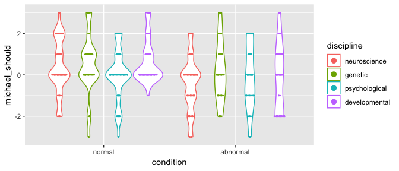

``` r
exp3_included %>%
  vio_dot("michael_would", "condition",  "discipline", dotsize = 0.35)
```

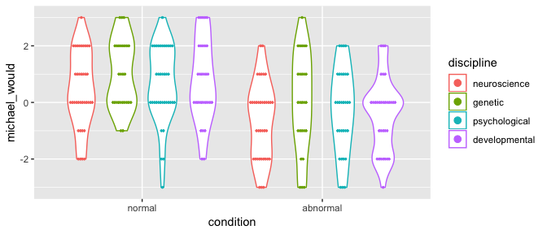

### Group means

Association with a normal mechanism is still consistently taken to support belief reinforcement, whereas association with an abnormal mechanism is not. Only exception is the cognitive explanation (and only absent there for the normative judgment, not the predictive one).

``` r
exp3_included %$%
  tapply(michael_should, list(condition, discipline), mean) %>%
  kable()
```

|          |  neuroscience|  genetic|  psychological|  developmental|
|----------|-------------:|--------:|--------------:|--------------:|
| normal   |        0.3243|   0.5185|        -0.0270|         0.6452|
| abnormal |       -0.4595|   0.1538|        -0.0968|        -0.1562|

``` r
exp3_included %$%
  tapply(michael_would, list(condition, discipline), mean) %>%
  kable()
```

|          |  neuroscience|  genetic|  psychological|  developmental|
|----------|-------------:|--------:|--------------:|--------------:|
| normal   |        0.4324|        1|         0.6216|         0.7742|
| abnormal |       -0.6486|        0|        -0.2903|        -0.4062|

Effect of normality is again qualitatively the same across domains.

``` r
exp3_included %$%
  tapply(michael_should, list(condition, domain), mean) %>%
  kable()
```

|          |  scientific|  religious|    moral|
|----------|-----------:|----------:|--------:|
| normal   |      0.2909|     0.3611|   0.3902|
| abnormal |     -0.2857|    -0.0638|  -0.1818|

``` r
exp3_included %$%
  tapply(michael_would, list(condition, domain), mean) %>%
  kable()
```

|          |  scientific|  religious|    moral|
|----------|-----------:|----------:|--------:|
| normal   |      0.4909|     0.8056|   0.8293|
| abnormal |     -0.3429|    -0.4894|  -0.2500|

Plot for Paper
--------------

``` r
exp3_included %>%
  paper_plot(
    y = "michael_should",
    x = "discipline", x_lab = "Explanation Discipline",
    color = "condition", color_lab = "Mechanism Type",
    ylim = c(-0.75, 1), dodge = 0.25
  )
```

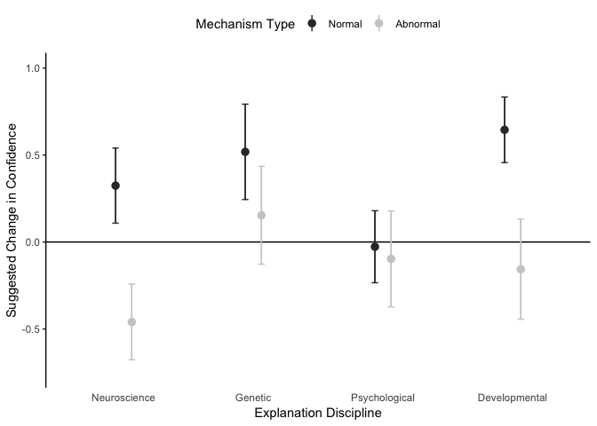

ANOVAs
------

Main effect of mechanism type, no other significant effects or interactions.

``` r
exp3_should_lm <-
  exp3_included %$% lm(michael_should ~ condition * discipline * prevalence)
ANOVA(exp3_should_lm)
```

| term                            |     sumsq|   df|  statistic|  p.value|  Partial eta^2|
|:--------------------------------|---------:|----:|----------:|--------:|--------------:|
| condition                       |   19.3442|    1|    10.2993|   0.0015|         0.0391|
| discipline                      |    6.4015|    3|     1.1361|   0.3351|         0.0186|
| prevalence                      |    0.2925|    1|     0.1557|   0.6935|         0.0007|
| condition:discipline            |    6.6471|    3|     1.1797|   0.3181|         0.0142|
| condition:prevalence            |    0.5876|    1|     0.3129|   0.5764|         0.0008|
| discipline:prevalence           |    9.4755|    3|     1.6817|   0.1715|         0.0195|
| condition:discipline:prevalence |    8.1514|    3|     1.4467|   0.2298|         0.0176|
| Residuals                       |  454.5237|  242|           |         |               |

As in Experiments 1 and 2, the same effects are seen for predictive judgments.

``` r
exp3_would_lm <-
  exp3_included %$% lm(michael_would ~ condition * discipline * prevalence)
ANOVA(exp3_would_lm)
```

| term                            |     sumsq|   df|  statistic|  p.value|  Partial eta^2|
|:--------------------------------|---------:|----:|----------:|--------:|--------------:|
| condition                       |   65.6746|    1|    33.7151|   0.0000|         0.1292|
| discipline                      |    9.3741|    3|     1.6041|   0.1890|         0.0241|
| prevalence                      |    1.0520|    1|     0.5401|   0.4631|         0.0013|
| condition:discipline            |    0.7731|    3|     0.1323|   0.9408|         0.0017|
| condition:prevalence            |    0.0351|    1|     0.0180|   0.8934|         0.0000|
| discipline:prevalence           |    5.0891|    3|     0.8709|   0.4568|         0.0107|
| condition:discipline:prevalence |   14.6153|    3|     2.5010|   0.0601|         0.0301|
| Residuals                       |  471.3983|  242|           |         |               |

### Check assumptions for ANOVAs

``` r
exp3_included %$%
  leveneTest(michael_should ~ condition * discipline * prevalence)
```

|       |   Df|  F value|  Pr(&gt;F)|
|-------|----:|--------:|----------:|
| group |   15|   0.7926|     0.6855|
|       |  242|         |           |

``` r
exp3_included %$%
  leveneTest(michael_would ~ condition * discipline * prevalence)
```

|       |   Df|  F value|  Pr(&gt;F)|
|-------|----:|--------:|----------:|
| group |   15|    0.624|     0.8541|
|       |  242|         |           |

``` r
exp3_should_lm %>% residuals() %>% shapiro.test()
```

    ##
    ##  Shapiro-Wilk normality test
    ##
    ## data:  .
    ## W = 0.99, p-value = 0.07

``` r
exp3_would_lm %>% residuals() %>% shapiro.test()
```

    ##
    ##  Shapiro-Wilk normality test
    ##
    ## data:  .
    ## W = 0.99, p-value = 0.1

### Verify results hold without strict exclusion criteria

Effect of mechanism type remains even including participants who answered one or more comprehension questions incorrectly.

``` r
exp3_finishers <- exp3_data %>% drop_na()
exp3_finishers.lm <-
  exp3_finishers %$% lm(michael_should ~ condition * discipline * prevalence)
ANOVA(exp3_finishers.lm)
```

| term                            |     sumsq|   df|  statistic|  p.value|  Partial eta^2|
|:--------------------------------|---------:|----:|----------:|--------:|--------------:|
| condition                       |   15.2001|    1|     7.6315|   0.0060|         0.0170|
| discipline                      |   12.7790|    3|     2.1386|   0.0947|         0.0148|
| prevalence                      |    0.2944|    1|     0.1478|   0.7008|         0.0004|
| condition:discipline            |    9.1609|    3|     1.5331|   0.2053|         0.0115|
| condition:prevalence            |    0.1725|    1|     0.0866|   0.7687|         0.0001|
| discipline:prevalence           |    2.6799|    3|     0.4485|   0.7185|         0.0031|
| condition:discipline:prevalence |    4.8653|    3|     0.8142|   0.4865|         0.0058|
| Residuals                       |  836.5363|  420|           |         |               |

Belief Reinforcement/Undermining
--------------------------------

``` r
exp3_included %>%
  group_by(condition) %>%
  summarise(
    michael_should = mean(michael_should),
    michael_would = mean(michael_would)
  )
```

| condition |  michael\_should|  michael\_would|
|:----------|----------------:|---------------:|
| normal    |           0.3409|          0.6818|
| abnormal  |          -0.1667|         -0.3651|

Testing against the scale midpoint again confirms reinforcement for association with normal mechanisms, no evidence of reinforcement for abnormal mechanisms.

``` r
exp3_included %>%
  group_by(condition) %>%
  do(tidy(t.test(.$michael_should))) %>%
  select(-c(method, alternative))
```

| condition |  estimate|  statistic|  p.value|  parameter|  conf.low|  conf.high|
|:----------|---------:|----------:|--------:|----------:|---------:|----------:|
| normal    |    0.3409|      3.067|   0.0026|        131|    0.1210|     0.5608|
| abnormal  |   -0.1667|     -1.265|   0.2083|        125|   -0.4275|     0.0941|

``` r
exp3_included %>%
  group_by(condition) %>%
  do(tidy(t.test(.$michael_would))) %>%
  select(-c(method, alternative))
```

| condition |  estimate|  statistic|  p.value|  parameter|  conf.low|  conf.high|
|:----------|---------:|----------:|--------:|----------:|---------:|----------:|
| normal    |    0.6818|      5.828|   0.0000|        131|    0.4504|     0.9132|
| abnormal  |   -0.3651|     -2.803|   0.0059|        125|   -0.6229|    -0.1073|

First-Person Judgments
----------------------

Exclude participants who were neutral about explained belief in analyzing "you would"/"you should" data. Use the remaining 242 participants.

``` r
exp3_with_belief <-
  exp3_included %>%
  filter(own_belief != 0) %>%
  mutate(
    own_opposing = agrees_with_michael %>%
      parse_factor(levels = c("TRUE", "FALSE")) %>%
      recode_factor("TRUE" = "own", "FALSE" = "opposing")
  )
nrow(exp3_with_belief)
```

    ## [1] 242

``` r
exp3_with_belief %>% count(condition, discipline, agrees_with_michael)
```

| condition | discipline    | agrees\_with\_michael |    n|
|:----------|:--------------|:----------------------|----:|
| normal    | neuroscience  | FALSE                 |   11|
| normal    | neuroscience  | TRUE                  |   24|
| normal    | genetic       | FALSE                 |   10|
| normal    | genetic       | TRUE                  |   16|
| normal    | psychological | FALSE                 |   16|
| normal    | psychological | TRUE                  |   19|
| normal    | developmental | FALSE                 |   10|
| normal    | developmental | TRUE                  |   19|
| abnormal  | neuroscience  | FALSE                 |   16|
| abnormal  | neuroscience  | TRUE                  |   18|
| abnormal  | genetic       | FALSE                 |    8|
| abnormal  | genetic       | TRUE                  |   18|
| abnormal  | psychological | FALSE                 |   15|
| abnormal  | psychological | TRUE                  |   11|
| abnormal  | developmental | FALSE                 |   16|
| abnormal  | developmental | TRUE                  |   15|

### First-person distribution and means

``` r
exp3_with_belief %>%
  vio_dot("you_would", "condition", "agrees_with_michael", dotsize = 0.2)
```

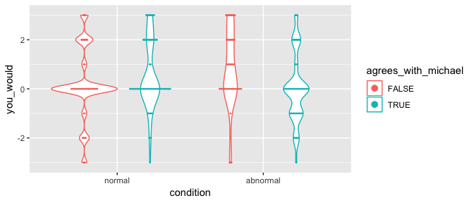

``` r
exp3_with_belief %>%
  vio_dot("you_should", "condition", "agrees_with_michael", dotsize = 0.2)
```

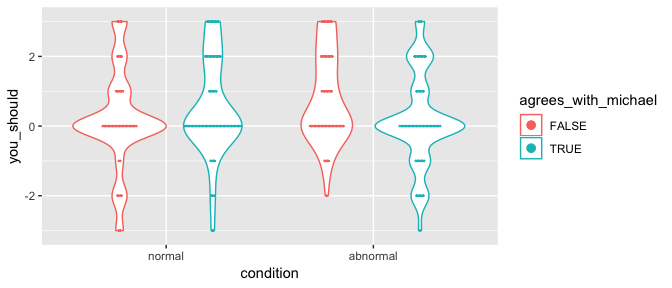

When participants read an explanation for their own belief, their belief is is more reinforced by explanations that invoke a normal mechanism than an abnormal mechanism, but when they read an explanation for the opposing belief, their belief is more reinforced when the explanation invokes an *abnormal* mechanism.

``` r
exp3_belief_gathered <-
  exp3_with_belief %>%
  gather(you_would, you_should, key = "judgment", value = "value")

exp3_with_belief %$%
  tapply(you_would, list(condition, own_opposing), mean) %>%
  kable()
```

|          |     own|  opposing|
|----------|-------:|---------:|
| normal   |  0.5641|    0.1915|
| abnormal |  0.0161|    0.8000|

``` r
exp3_with_belief %$%
  tapply(you_should, list(condition, own_opposing), mean) %>%
  kable()
```

|          |     own|  opposing|
|----------|-------:|---------:|
| normal   |  0.5256|    0.2128|
| abnormal |  0.1774|    0.8000|

### First-person plot for paper

``` r
exp3_with_belief %>%
  paper_plot(
    y = "you_would",
    x = "own_opposing", x_lab = "Explained Belief",
    color = "condition", color_lab = "Mechanism Type",
    ylim = c(-0.15, 1), dodge = 0.5
  )
```

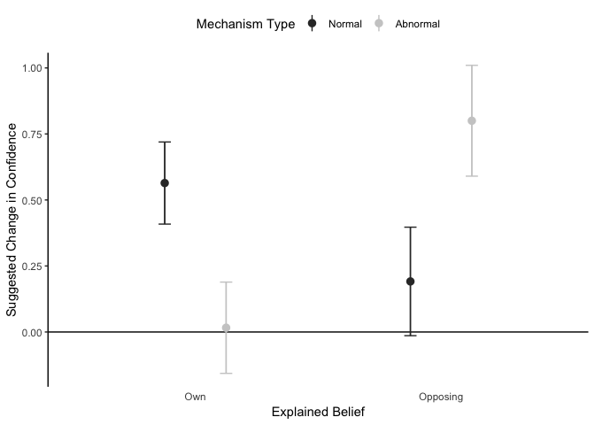

### First-person ANOVAs

There is a significant interaction between mechanism type and participant agreement with Michael. Participants reported that explanations that appealed to abnormal functioning would reinforce their own beliefs *more* than explanations that appealed to normal functioning, *as long as those explanations were for the opposing belief*. The pattern was reversed if they read explanations for their belief. No significant main effects or other significant interactions.

``` r
exp3_you_would_lm <-
  exp3_with_belief %$%
  lm(you_would ~ condition * discipline * agrees_with_michael)
ANOVA(exp3_you_would_lm)
```

| term                                       |     sumsq|   df|  statistic|  p.value|  Partial eta^2|
|:-------------------------------------------|---------:|----:|----------:|--------:|--------------:|
| condition                                  |    0.0133|    1|     0.0064|   0.9362|         0.0007|
| discipline                                 |    1.7718|    3|     0.2859|   0.8355|         0.0018|
| agrees\_with\_michael                      |    0.8166|    1|     0.3954|   0.5301|         0.0035|
| condition:discipline                       |    2.4132|    3|     0.3895|   0.7607|         0.0038|
| condition:agrees\_with\_michael            |   15.8164|    1|     7.6577|   0.0061|         0.0354|
| discipline:agrees\_with\_michael           |    5.7500|    3|     0.9280|   0.4280|         0.0125|
| condition:discipline:agrees\_with\_michael |    5.1246|    3|     0.8271|   0.4802|         0.0109|
| Residuals                                  |  466.7837|  226|           |         |               |

``` r
exp3_with_belief %>%
  ggplot(
    aes(x = agrees_with_michael, y = you_would,
        group = condition, color = condition)
  ) +
  geom_line(stat = "summary", fun.y = "mean")
```

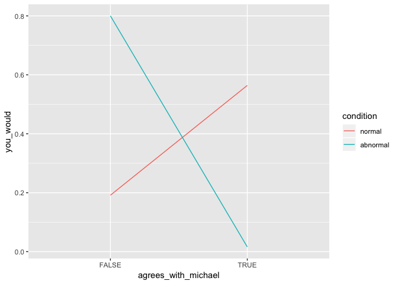

``` r
exp3_with_belief %>%
  group_by(agrees_with_michael) %>%
  do(tidy(t.test(.$you_would ~ .$condition))) %>%
  select(-c(method, alternative))
```

| agrees\_with\_michael |  estimate|  estimate1|  estimate2|  statistic|  p.value|  parameter|  conf.low|  conf.high|
|:----------------------|---------:|----------:|----------:|----------:|--------:|----------:|---------:|----------:|
| FALSE                 |   -0.6085|     0.1915|     0.8000|     -2.072|   0.0409|      99.65|   -1.1912|    -0.0258|
| TRUE                  |    0.5480|     0.5641|     0.0161|      2.357|   0.0199|     131.47|    0.0881|     1.0079|

Again, the same effects are seen for predictive and normative judgments.

``` r
exp3_you_should_lm <-
  exp3_with_belief %$%
  lm(you_should ~ condition * discipline * agrees_with_michael)
ANOVA(exp3_you_should_lm)
```

| term                                       |     sumsq|   df|  statistic|  p.value|  Partial eta^2|
|:-------------------------------------------|---------:|----:|----------:|--------:|--------------:|
| condition                                  |    0.9444|    1|     0.5125|   0.4748|         0.0001|
| discipline                                 |    2.3748|    3|     0.4296|   0.7320|         0.0084|
| agrees\_with\_michael                      |    0.4224|    1|     0.2292|   0.6326|         0.0026|
| condition:discipline                       |    0.7689|    3|     0.1391|   0.9365|         0.0026|
| condition:agrees\_with\_michael            |   11.5186|    1|     6.2508|   0.0131|         0.0266|
| discipline:agrees\_with\_michael           |    8.6538|    3|     1.5654|   0.1986|         0.0197|
| condition:discipline:agrees\_with\_michael |    5.9860|    3|     1.0828|   0.3572|         0.0142|
| Residuals                                  |  416.4621|  226|           |         |               |

``` r
exp3_with_belief %>%
  ggplot(
    aes(x = agrees_with_michael, y = you_should,
        group = condition, color = condition)
  ) +
  geom_line(stat = "summary", fun.y = "mean")
```

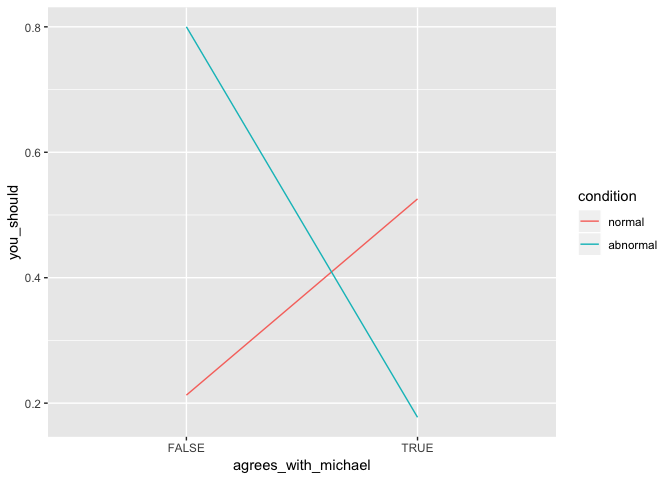

``` r
exp3_with_belief %>%
  group_by(agrees_with_michael) %>%
  do(tidy(t.test(.$you_should ~ .$condition))) %>%
  select(-c(method, alternative))
```

| agrees\_with\_michael |  estimate|  estimate1|  estimate2|  statistic|  p.value|  parameter|  conf.low|  conf.high|
|:----------------------|---------:|----------:|----------:|----------:|--------:|----------:|---------:|----------:|
| FALSE                 |   -0.5872|     0.2128|     0.8000|     -2.183|   0.0316|       93.9|   -1.1215|     -0.053|
| TRUE                  |    0.3482|     0.5256|     0.1774|      1.515|   0.1322|      133.3|   -0.1065|      0.803|

#### Check assumptions for first-person ANOVAs

Shapiro-Wilk test is significant here too, but results are again the same using a robust test, and previous visualization still doesn't suggest any issues with using the mean as a summary statistic.

``` r
exp3_included %$%
  leveneTest(you_would ~ condition * discipline * agrees_with_michael)
```

|       |   Df|  F value|  Pr(&gt;F)|
|-------|----:|--------:|----------:|
| group |   15|   0.5248|     0.9257|
|       |  242|         |           |

``` r
exp3_included %$%
  leveneTest(you_should ~ condition * discipline * agrees_with_michael)
```

|       |   Df|  F value|  Pr(&gt;F)|
|-------|----:|--------:|----------:|
| group |   15|   0.7921|      0.686|
|       |  242|         |           |

``` r
exp3_you_would_lm %>% residuals() %>% shapiro.test()
```

    ##
    ##  Shapiro-Wilk normality test
    ##
    ## data:  .
    ## W = 0.96, p-value = 4e-06

``` r
exp3_included %>%
  mutate(agrees_fac = parse_factor(agrees_with_michael, NULL)) %$%
  t2way(you_would ~ condition * agrees_fac)
```

    ## Call:
    ## t2way(formula = you_would ~ condition * agrees_fac)
    ##
    ##                        value p.value
    ## condition             0.0007   0.979
    ## agrees_fac            1.8870   0.172
    ## condition:agrees_fac 13.5911   0.001

``` r
exp3_included %>%
  mutate(agrees_fac = parse_factor(agrees_with_michael, NULL)) %$%
  t2way(you_should ~ condition * agrees_fac)
```

    ## Call:
    ## t2way(formula = you_should ~ condition * agrees_fac)
    ##
    ##                       value p.value
    ## condition            0.1291   0.720
    ## agrees_fac           0.4057   0.526
    ## condition:agrees_fac 4.6264   0.034

### Confirm first-person results the same across belief domains

Interaction between participant's belief and mechanism type is seen for all belief domains.

``` r
exp3_with_belief %>%
  group_by(condition, agrees_with_michael, domain) %>%
  summarise(mean(you_would), mean(you_should))
```

| condition | agrees\_with\_michael | domain     |  mean(you\_would)|  mean(you\_should)|
|:----------|:----------------------|:-----------|-----------------:|------------------:|
| normal    | FALSE                 | scientific |            0.6111|             0.5000|
| normal    | FALSE                 | religious  |           -0.3571|             0.2857|
| normal    | FALSE                 | moral      |            0.2000|            -0.2000|
| normal    | TRUE                  | scientific |            0.6000|             0.4571|
| normal    | TRUE                  | religious  |            0.6842|             0.7895|
| normal    | TRUE                  | moral      |            0.4167|             0.4167|
| abnormal  | FALSE                 | scientific |            0.8824|             0.9412|
| abnormal  | FALSE                 | religious  |            0.4706|             0.7647|
| abnormal  | FALSE                 | moral      |            1.0000|             0.7143|
| abnormal  | TRUE                  | scientific |            0.0625|             0.0625|
| abnormal  | TRUE                  | religious  |            0.0000|             0.2400|
| abnormal  | TRUE                  | moral      |            0.0000|             0.1905|

Experiment 4
============

Load data.

``` r
exp4_raw <- read_csv("data/experiment4_data.csv")
exp4_data <-
  exp4_raw %>%
  select(
    participant_id = ResponseId,
    consent = Q1,
    belief_in_god = Q26_18,
    conf_in_existing = Q27_29, heard_of_existing = Q29,
    michael_should = Q33, michael_would = Q31,
    plausible = Q34, realistic = Q35,
    common_check = Q36, proper_check = Q37, agree_check = Q38,
    done_before = Q106,
    sex = Q81, age = Q82,
    common = CommonUncommon, proper = ProperImproper
  ) %>%
  # Drop extra header rows.
  slice(-1:-2) %>%
  type_convert() %>%
  # Center Likerts at 0.
  mutate_at(
    vars(belief_in_god, michael_should, michael_would, plausible, realistic),
    funs(. - 4)
  ) %>%
  mutate(
    theism = case_when(
      belief_in_god > 0 ~ "theist",
      belief_in_god < 0 ~ "atheist",
      belief_in_god == 0 ~ "neither") %>%
      parse_factor(levels = c("theist", "atheist", "neither")),
    consent = consent %>%
      recode_factor("2" = "consent", "1" = "no_consent"),
    done_before = done_before %>%
      recode_factor("1" = "yes", "2" = "maybe", "3" = "no"),
    sex = sex %>%
      recode_factor("1" = "male", "2" = "female", "3" = "other"),
    common = common %>%
      parse_factor(levels = c("common", "uncommon"), include_na = FALSE),
    proper = proper %>%
      parse_factor(levels = c("proper", "improper"), include_na = FALSE),
    pass.common = ((common == "common" & common_check == 1)
                   | (common == "uncommon" & common_check == 4)),
    pass.proper = ((proper == "proper" & proper_check == 1)
                   | (proper == "improper" & proper_check == 2)),
    pass.agree = agree_check == 1
  )
```

Participants
------------

6 participants didn't complete the experiment. Another 12 participants think they might have done a similar study before. 189 of the rest missed at least 1 of 3 reading comprehension questions. Analyses will focus on data from the remaining 196 participants.

``` r
exp4_data %>%
  filter(consent == "consent") %>%
  count(
    complete.cases(.),
    done_before,
    pass.common & pass.proper & pass.agree
  )
exp4_included <-
  exp4_data %>%
  drop_na() %>%
  filter(done_before == "no", pass.common, pass.proper, pass.agree)
```

| complete.cases(.) | done\_before | pass.common & pass.proper & pass.agree |    n|
|:------------------|:-------------|:---------------------------------------|----:|
| FALSE             | no           | FALSE                                  |    1|
| FALSE             | no           | TRUE                                   |    3|
| FALSE             | no           | NA                                     |    1|
| FALSE             | NA           | FALSE                                  |    1|
| TRUE              | yes          | FALSE                                  |    3|
| TRUE              | yes          | TRUE                                   |    2|
| TRUE              | maybe        | FALSE                                  |    5|
| TRUE              | maybe        | TRUE                                   |    2|
| TRUE              | no           | FALSE                                  |  189|
| TRUE              | no           | TRUE                                   |  196|

### Demographics

``` r
exp4_included %>% select(sex, age) %>% summary() %>% kable()
```

|     |    sex    |      age     |
|-----|:---------:|:------------:|
|     |  male :98 |  Min. :18.0  |
|     | female:98 | 1st Qu.:29.0 |
|     | other : 0 | Median :35.0 |
|     |           |  Mean :38.1  |
|     |           | 3rd Qu.:45.0 |
|     |           |  Max. :73.0  |

### Inclusion/exclusion by condition

``` r
exp4_included %>% count(common, proper) %>% spread(proper, n)
```

| common   |  proper|  improper|
|:---------|-------:|---------:|
| common   |      67|        45|
| uncommon |      42|        42|

Distribution and Means
----------------------

``` r
exp4_included %>% vio_dot("michael_should", "common", "proper", dotsize = 0.25)
```

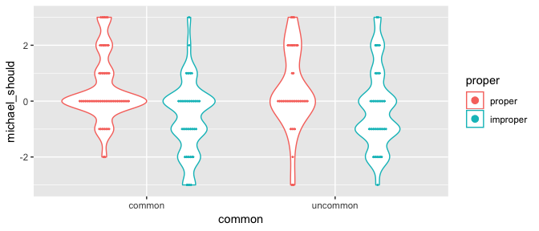

``` r
exp4_included %>% vio_dot("michael_would", "common", "proper", dotsize = 0.25)
```

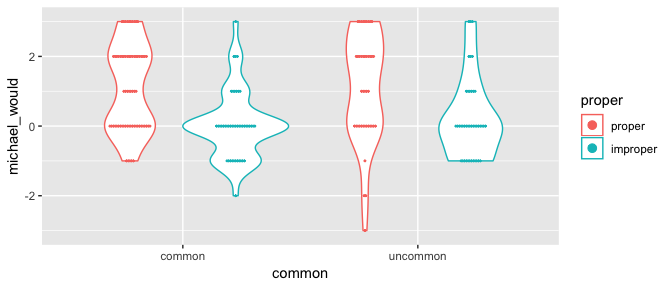

### Group means

Participants report that association with a properly functioning mechanism supports belief reinforcement, association with an improperly functioning one supports belief undermining. Whether the associated mechanism is common or uncommon appears to make no difference.

``` r
exp4_included %$%
  tapply(michael_should, list(common, proper), mean) %>%
  kable()
```

|          |  proper|  improper|
|----------|-------:|---------:|
| common   |  0.4179|   -0.6000|
| uncommon |  0.3571|   -0.2857|

``` r
exp4_included %$%
  tapply(michael_would, list(common, proper), mean) %>%
  kable()
```

|          |  proper|  improper|
|----------|-------:|---------:|
| common   |   1.090|    0.0444|
| uncommon |   1.095|    0.2143|

Plot for Paper
--------------

``` r
exp4_included %>%
  paper_plot(
    y = "michael_should",
    x = "common", x_lab = "Descriptive Normality",
    color = "proper", color_lab = "Prescriptive Normality",
    ylim = c(-1, 1), dodge = 0.5
  )
```

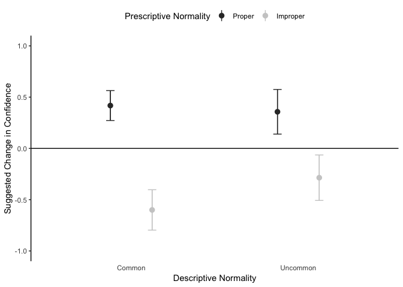

ANOVAs
------

ANOVA confirms a main effect of prescriptive normality (proper functioning), no indications of an effect of statistical normality, and no interaction.

``` r
exp4_should_lm <- exp4_included %$% lm(michael_should ~ common * proper)
ANOVA(exp4_should_lm)
```

| term          |     sumsq|   df|  statistic|  p.value|  Partial eta^2|
|:--------------|---------:|----:|----------:|--------:|--------------:|
| common        |    0.7582|    1|     0.4316|   0.5120|         0.0017|
| proper        |   32.5381|    1|    18.5209|   0.0000|         0.0938|
| common:proper |    1.6594|    1|     0.9446|   0.3323|         0.0049|
| Residuals     |  337.3128|  192|           |         |               |

As in previous experiments, the same effects are seen for predictive judgments.

``` r
exp4_would_lm <- exp4_included %$% lm(michael_would ~ common * proper)
ANOVA(exp4_would_lm)
```

| term          |     sumsq|   df|  statistic|  p.value|  Partial eta^2|
|:--------------|---------:|----:|----------:|--------:|--------------:|
| common        |    0.3635|    1|     0.2341|   0.6290|         0.0010|
| proper        |   43.7638|    1|    28.1907|   0.0000|         0.1321|
| common:proper |    0.3179|    1|     0.2048|   0.6514|         0.0011|
| Residuals     |  298.0643|  192|           |         |               |

### Check assumptions for ANOVAs

There is variance heterogeneity for "would" judgments and Shapiro-Wilk test is significant in both cases. But the results are the same using robust tests.

``` r
exp4_included %$% leveneTest(michael_should ~ common * proper)
```

|       |   Df|  F value|  Pr(&gt;F)|
|-------|----:|--------:|----------:|
| group |    3|    1.336|     0.2639|
|       |  192|         |           |

``` r
exp4_included %$% leveneTest(michael_would ~ common * proper)
```

|       |   Df|  F value|  Pr(&gt;F)|
|-------|----:|--------:|----------:|
| group |    3|    7.369|      1e-04|
|       |  192|         |           |

``` r
exp4_should_lm %>% residuals() %>% shapiro.test()
```

    ##
    ##  Shapiro-Wilk normality test
    ##
    ## data:  .
    ## W = 0.95, p-value = 3e-06

``` r
exp4_would_lm %>% residuals() %>% shapiro.test()
```

    ##
    ##  Shapiro-Wilk normality test
    ##
    ## data:  .
    ## W = 0.94, p-value = 5e-07

``` r
exp4_included %$% t2way(michael_should ~ common * proper)
```

    ## Call:
    ## t2way(formula = michael_should ~ common * proper)
    ##
    ##                 value p.value
    ## common         0.4124   0.523
    ## proper        15.0737   0.001
    ## common:proper  0.0027   0.959

``` r
exp4_included %$% t2way(michael_would ~ common * proper)
```

    ## Call:
    ## t2way(formula = michael_would ~ common * proper)
    ##
    ##                 value p.value
    ## common         0.2100   0.648
    ## proper        25.7131   0.001
    ## common:proper  0.0155   0.902

### Verify results hold without strict exclusion criteria

With all participants who completed the experiment included, the effect of prescriptive normality remains and there is still no effect of statistical normality or evidence of an interaction.

``` r
exp4_finishers <- exp4_data %>% drop_na()
ANOVA(exp4_finishers %$% lm(michael_should ~ common * proper))
```

| term          |     sumsq|   df|  statistic|  p.value|  Partial eta^2|
|:--------------|---------:|----:|----------:|--------:|--------------:|
| common        |    0.0160|    1|     0.0085|   0.9267|         0.0000|
| proper        |   30.9789|    1|    16.4150|   0.0001|         0.0401|
| common:proper |    0.1607|    1|     0.0852|   0.7706|         0.0002|
| Residuals     |  741.6839|  393|           |         |               |

``` r
ANOVA(exp4_finishers %$% lm(michael_would ~ common * proper))
```

| term          |     sumsq|   df|  statistic|  p.value|  Partial eta^2|
|:--------------|---------:|----:|----------:|--------:|--------------:|
| common        |    1.2170|    1|     0.6873|   0.4076|         0.0017|
| proper        |   31.4231|    1|    17.7454|   0.0000|         0.0432|
| common:proper |    0.0249|    1|     0.0141|   0.9056|         0.0000|
| Residuals     |  695.9121|  393|           |         |               |

Belief Reinforcement/Undermining
--------------------------------

``` r
exp4_included %>%
  group_by(proper) %>%
  summarise(mean(michael_should), mean(michael_would))
```

| proper   |  mean(michael\_should)|  mean(michael\_would)|
|:---------|----------------------:|---------------------:|
| proper   |                 0.3945|                1.0917|
| improper |                -0.4483|                0.1264|

Testing against the scale midpoint confirms reinforcement for association with properly functioning mechanisms, undermining for association with improperly functioning mechanisms (except that people merely predict no reinforcement, rather that significant undermining, when making "would" judgments).

``` r
exp4_included %>%
  group_by(proper) %>%
  do(tidy(t.test(.$michael_should))) %>%
  select(-c(method, alternative))
```

| proper   |  estimate|  statistic|  p.value|  parameter|  conf.low|  conf.high|
|:---------|---------:|----------:|--------:|----------:|---------:|----------:|
| proper   |    0.3945|      3.226|   0.0017|        108|    0.1521|     0.6369|
| improper |   -0.4483|     -3.032|   0.0032|         86|   -0.7422|    -0.1544|

``` r
exp4_included %>%
  group_by(proper) %>%
  do(tidy(t.test(.$michael_would))) %>%
  select(-c(method, alternative))
```

| proper   |  estimate|  statistic|  p.value|  parameter|  conf.low|  conf.high|
|:---------|---------:|----------:|--------:|----------:|---------:|----------:|
| proper   |    1.0917|      8.353|   0.0000|        108|    0.8327|     1.3508|
| improper |    0.1264|      1.107|   0.2714|         86|   -0.1006|     0.3535|

Confirm Scenarios Are Plausible and Realistic
---------------------------------------------

Participants find the hypothetical explanations at least somewhat plausible and realistic.

``` r
exp4_included %>% select("plausible", "realistic") %>% summary() %>% kable()
```

|     |    plausible   |    realistic   |
|-----|:--------------:|:--------------:|
|     |  Min. :-3.000  |  Min. :-3.000  |
|     | 1st Qu.:-1.000 | 1st Qu.:-1.000 |
|     | Median : 1.000 | Median : 1.000 |
|     |  Mean : 0.255  |  Mean : 0.628  |
|     | 3rd Qu.: 1.000 | 3rd Qu.: 2.000 |
|     |  Max. : 3.000  |  Max. : 3.000  |

Explanations that appeal to improper functioning are seen as plausible. Explanations that appeal to common and uncommon mechanisms were seen as equally plausible.

``` r
exp4_included %>%
  ezANOVA(
    wid = .(participant_id),
    dv = .(plausible),
    between = .(common, proper),
    type = 3,
    detailed = TRUE
  )
```

    ## Coefficient covariances computed by hccm()

    ## $ANOVA
    ##          Effect DFn DFd      SSn   SSd       F       p p<.05       ges
    ## 1   (Intercept)   1 192  8.74167 488.2 3.43826 0.06524       1.759e-02
    ## 2        common   1 192  0.03104 488.2 0.01221 0.91214       6.357e-05
    ## 3        proper   1 192 15.08121 488.2 5.93172 0.01578     * 2.997e-02
    ## 4 common:proper   1 192  0.60199 488.2 0.23677 0.62710       1.232e-03
    ##
    ## $`Levene's Test for Homogeneity of Variance`
    ##   DFn DFd   SSn   SSd     F      p p<.05
    ## 1   3 192 4.406 189.2 1.491 0.2184

``` r
exp4_included %>%
  ezANOVA(
    wid = .(participant_id),
    dv = .(realistic),
    between = .(common, proper),
    type = 3,
    detailed = TRUE
  )
```

    ## Coefficient covariances computed by hccm()

    ## $ANOVA
    ##          Effect DFn DFd     SSn   SSd        F         p p<.05       ges
    ## 1   (Intercept)   1 192 70.6334 523.1 25.92676 8.431e-07     * 0.1189701
    ## 2        common   1 192  0.1829 523.1  0.06714 7.958e-01       0.0003496
    ## 3        proper   1 192  4.2369 523.1  1.55520 2.139e-01       0.0080349
    ## 4 common:proper   1 192  0.1788 523.1  0.06562 7.981e-01       0.0003416
    ##
    ## $`Levene's Test for Homogeneity of Variance`
    ##   DFn DFd   SSn   SSd      F      p p<.05
    ## 1   3 192 1.029 227.4 0.2897 0.8328

### Confirm effects are not a consequence of differences in plausibility

We find the same results (a main effect of proper functioning and no other significant effects or interactions) when including plausibility as a covariate.

``` r
exp4_should_plaus_lm <- exp4_included %$%
  lm(michael_should ~ common * proper + plausible)
ANOVA(exp4_should_plaus_lm)
```

| term          |     sumsq|   df|  statistic|  p.value|  Partial eta^2|
|:--------------|---------:|----:|----------:|--------:|--------------:|
| common        |    0.7522|    1|     0.4261|   0.5147|         0.0017|
| proper        |   32.4134|    1|    18.3640|   0.0000|         0.0931|
| plausible     |    0.1886|    1|     0.1068|   0.7441|         0.0006|
| common:proper |    1.6969|    1|     0.9614|   0.3281|         0.0050|
| Residuals     |  337.1242|  191|           |         |               |

``` r
exp4_would_plaus_lm <- exp4_included %$% aov(michael_would ~ common * proper + plausible)
ANOVA(exp4_would_plaus_lm)
```

| term          |     sumsq|   df|  statistic|  p.value|  Partial eta^2|
|:--------------|---------:|----:|----------:|--------:|--------------:|
| common        |    0.3662|    1|     0.2347|   0.6286|         0.0011|
| proper        |   41.8095|    1|    26.7989|   0.0000|         0.1267|
| plausible     |    0.0818|    1|     0.0524|   0.8191|         0.0003|
| common:proper |    0.3063|    1|     0.1963|   0.6582|         0.0010|
| Residuals     |  297.9825|  191|           |         |               |

Experiment 5
============

Load data.

``` r
exp5_raw <- read_csv("data/experiment5_data.csv")
exp5_data <-
  exp5_raw %>%
  select(
    participant_id = ResponseId,
    consent = Q1,
    important = Q27_1, science_class = Q27_2, theology_class = Q27_3,
    accept = Q27_4, gov_funding = Q27_5, who_funded = Q27_6,
    replicated = Q27_7,
    belief_likert = Q26_18,
    attention_check = Q13_9_TEXT, reading_check = Q19,
    sex = Q81, age = Q82,
    done_before = Q106,
    explained_belief = GodAtheism, condition = NormalAbnormal,
    presence = PossessLack
  ) %>%
  # Drop extra header rows.
  slice(-1:-2) %>%
  type_convert() %>%
  # Center Likerts at 0.
  mutate_at(
    vars(important, science_class, theology_class, accept,
         gov_funding, who_funded, replicated),
    funs(. - 18)
  ) %>%
  mutate(
    # Center another Likert at 0.
    belief_likert = belief_likert - 4,
    # Two items are reverse coded.
    who_funded = who_funded * -1,
    replicated = replicated * -1,
    composite_trust = (
      important + science_class + theology_class + accept
      + gov_funding + who_funded + replicated
    ) / 7,
    consent = consent %>%
      recode_factor("2" = "consent", "1" = "no_consent"),
    done_before = done_before %>%
      recode_factor("1" = "yes", "2" = "maybe", "3" = "no"),
    sex = sex %>%
      recode_factor("1" = "male", "2" = "female", "3" = "other"),
    explained_belief = explained_belief %>%
      recode_factor("God" = "god", "Atheism" = "atheism"),
    condition = condition %>%
      recode_factor("Normal" = "normal", "Abnormal" = "abnormal"),
    presence = presence %>%
      recode_factor("Possess" = "possess", "Lack" = "lack"),
    theism = case_when(
      belief_likert > 0 ~ "theist",
      belief_likert < 0 ~ "atheist",
      belief_likert == 0 ~ "neither"
    ) %>%
    parse_factor(
      levels = c("theist", "atheist", "neither"),
      include_na = FALSE
    ),
    reading_check = ifelse(is.na(reading_check), 0, reading_check),
    attention_correct = grepl("dax", attention_check, ignore.case = TRUE)
  )
```

Participants
------------

44 participants didn't complete the experiment. Another 41 participants think they might have done a similar study before. 17 of the rest missed a catch question, leaving 539 participants.

``` r
exp5_data %>%
  # Don't count leaving attention check blank as not finishing, just as wrong.
  select(-c(attention_check)) %>%
  filter(consent == "consent") %>%
  count(complete.cases(.), done_before, attention_correct)
exp5_included <-
  exp5_data %>%
  drop_na() %>%
  filter(consent == "consent", done_before == "no", attention_correct)
```

| complete.cases(.) | done\_before | attention\_correct |    n|
|:------------------|:-------------|:-------------------|----:|
| FALSE             | yes          | TRUE               |    1|
| FALSE             | no           | TRUE               |    5|
| FALSE             | NA           | FALSE              |   21|
| FALSE             | NA           | TRUE               |   17|
| TRUE              | yes          | TRUE               |    9|
| TRUE              | maybe        | FALSE              |    3|
| TRUE              | maybe        | TRUE               |   29|
| TRUE              | no           | FALSE              |   17|
| TRUE              | no           | TRUE               |  539|

### Demographics

``` r
exp5_included %>% select(sex, age, theism) %>% summary() %>% kable()
```

|     |     sex    |      age     |    theism   |
|-----|:----------:|:------------:|:-----------:|
|     |  male :309 |  Min. :18.0  | theist :230 |
|     | female:228 | 1st Qu.:24.0 | atheist:231 |
|     |  other : 2 | Median :28.0 | neither: 78 |
|     |            |  Mean :30.7  |             |
|     |            | 3rd Qu.:34.0 |             |
|     |            |  Max. :73.0  |             |

For results to be interpretable, limited to looking at participants who were not neutral on belief in God. Analyses will focus on data from the remaining 461 participants.

``` r
exp5_with_belief <-
  exp5_included %>%
  filter(theism != "neither") %>%
  droplevels() %>%
  mutate(
    own_opposing = case_when(
      explained_belief == "god" & theism == "theist" ~ "own",
      explained_belief == "atheism" & theism == "atheist" ~ "own",
      explained_belief == "god" & theism == "atheist" ~ "opposing",
      explained_belief == "atheism" & theism == "theist" ~ "opposing"
    ) %>%
    parse_factor(levels = c("own", "opposing"))
  )
nrow(exp5_with_belief)
```

    ## [1] 461

### Number of participants per condition (and prior belief in God)

``` r
exp5_with_belief %>% count(condition, explained_belief, theism, presence)
```

| condition | explained\_belief | theism  | presence |    n|
|:----------|:------------------|:--------|:---------|----:|
| normal    | god               | theist  | possess  |   32|
| normal    | god               | theist  | lack     |   27|
| normal    | god               | atheist | possess  |   22|
| normal    | god               | atheist | lack     |   30|
| normal    | atheism           | theist  | possess  |   34|
| normal    | atheism           | theist  | lack     |   21|
| normal    | atheism           | atheist | possess  |   24|
| normal    | atheism           | atheist | lack     |   22|
| abnormal  | god               | theist  | possess  |   23|
| abnormal  | god               | theist  | lack     |   31|
| abnormal  | god               | atheist | possess  |   32|
| abnormal  | god               | atheist | lack     |   33|
| abnormal  | atheism           | theist  | possess  |   35|
| abnormal  | atheism           | theist  | lack     |   27|
| abnormal  | atheism           | atheist | possess  |   38|
| abnormal  | atheism           | atheist | lack     |   30|

Distribution and Means
----------------------

``` r
exp5_with_belief %>%
  vio_dot("composite_trust", "condition", "explained_belief") +
  facet_grid(. ~ theism)
```

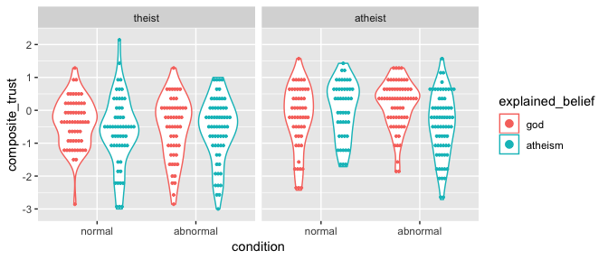

### Group means

Theists overall more skeptical of any hypothetical finding. Predicted interaction is seen (more skepticism for explanations of own belief by appeal to abnormal mechanism, *less* skepticism for explanations of opposing belief by appeal to abnormal mechanism). Although in predicted direction, effect is tiny (at best) among theists. But, that the effect reverses at all is important to showing the effect is about one's own beliefs, and not merely that everyone thinks abnormal mechanism explanations of atheism are more dubious than abnormal mechanism explanations of theism (and vice versa).

``` r
exp5_with_belief %>%
  group_by(theism, explained_belief, condition) %>%
  summarise(mean(composite_trust))
```

| theism  | explained\_belief | condition |  mean(composite\_trust)|
|:--------|:------------------|:----------|-----------------------:|
| theist  | god               | normal    |                 -0.3680|
| theist  | god               | abnormal  |                 -0.5423|
| theist  | atheism           | normal    |                 -0.6338|
| theist  | atheism           | abnormal  |                 -0.5853|
| atheist | god               | normal    |                 -0.2033|
| atheist | god               | abnormal  |                  0.1626|
| atheist | atheism           | normal    |                  0.0124|
| atheist | atheism           | abnormal  |                 -0.4475|

Plot for Paper
--------------

``` r
exp5_with_belief %>%
  ggplot(aes(x = own_opposing, y = composite_trust, color = condition)) +
  facet_grid(
    . ~ theism,
    labeller = labeller(theism = c(theist = "Theists", atheist = "Atheists"))
  ) +
  geom_hline(yintercept = 0) +
  geom_pointrange(
    stat = "summary",
    fun.data = mean_se,
    position = position_dodge(0.25)
  ) +
  geom_errorbar(
    stat = "summary",
    fun.data = mean_se,
    position = position_dodge(0.25),
    width = 0.1,
    show.legend = FALSE
  ) +
  scale_color_grey(name = "Mechanism Type", labels = str_to_title) +
  scale_x_discrete(name = "Explained Belief", labels = str_to_title) +
  scale_y_continuous(sec.axis = sec_axis(~ .)) +
  coord_cartesian(ylim = c(-0.75, 0.75)) +
  labs(y = "Suggested Change in Confidence") +
  theme_classic() +
  theme(
    legend.position = "top",
    axis.line.x = element_blank(),
    axis.ticks.x = element_blank(),
    strip.background = element_blank()
  )
```

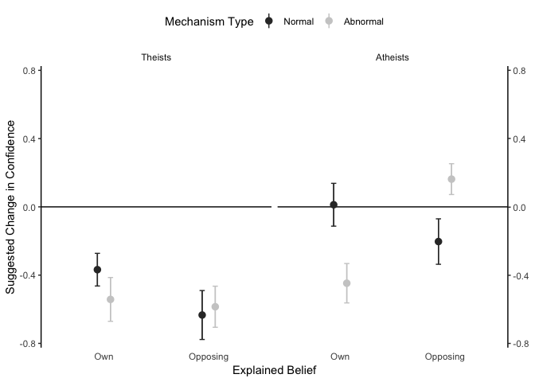

ANOVA
-----

There is a significant interaction between mechanism type, explained belief, and participant's belief, which reflects the hypothesized result, as described above. The main effect of participant's belief described above is also significant. Additionally, there is a significant main effect of explained belief: explanations for atheism were overall regarded more skeptically. Finally, there is an unpredicted three-way interaction between mechanism type, participant's belief, and presence/absence. It might indicate that atheists are somewhat more skeptical of abnormal presence explanations (i.e., displaying an abnormal pattern of brain activity) than they are of normal presence explanations (i.e., displaying a normal pattern of brain activity), but are somewhat less skeptical of abnormal absence explanations than normal absence explanations.

``` r
exp5_lm <-
  exp5_with_belief %$%
  lm(composite_trust ~ condition * explained_belief * theism * presence)
ANOVA(exp5_lm)
```

| term                                        |     sumsq|   df|  statistic|  p.value|  Partial eta^2|
|:--------------------------------------------|---------:|----:|----------:|--------:|--------------:|
| condition                                   |    0.3116|    1|     0.3901|   0.5326|         0.0007|
| explained\_belief                           |    3.3894|    1|     4.2432|   0.0400|         0.0139|
| theism                                      |   20.5175|    1|    25.6863|   0.0000|         0.0494|
| presence                                    |    0.0425|    1|     0.0532|   0.8177|         0.0006|
| condition:explained\_belief                 |    2.1762|    1|     2.7244|   0.0995|         0.0059|
| condition:theism                            |    0.0428|    1|     0.0536|   0.8170|         0.0000|
| explained\_belief:theism                    |    0.0168|    1|     0.0211|   0.8847|         0.0004|
| condition:presence                          |    0.8296|    1|     1.0385|   0.3087|         0.0022|
| explained\_belief:presence                  |    1.4685|    1|     1.8384|   0.1758|         0.0053|
| theism:presence                             |    0.4200|    1|     0.5258|   0.4687|         0.0022|
| condition:explained\_belief:theism          |    6.2747|    1|     7.8555|   0.0053|         0.0178|
| condition:explained\_belief:presence        |    0.5510|    1|     0.6898|   0.4067|         0.0015|
| condition:theism:presence                   |    4.6591|    1|     5.8329|   0.0161|         0.0128|
| explained\_belief:theism:presence           |    2.2832|    1|     2.8584|   0.0916|         0.0072|
| condition:explained\_belief:theism:presence |    1.1415|    1|     1.4291|   0.2326|         0.0032|
| Residuals                                   |  355.4537|  445|           |         |               |

``` r
interaction.ABC.plot(
  composite_trust, condition, explained_belief, theism,
  data = exp5_with_belief
)
```

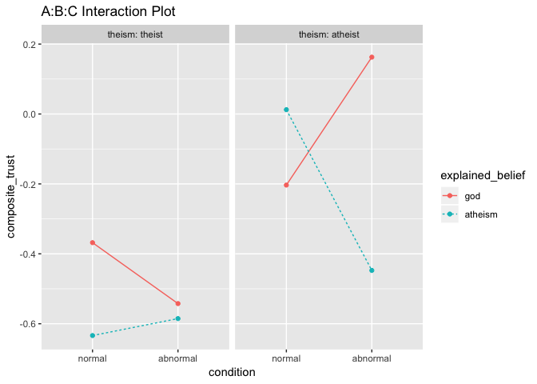

``` r
exp5_with_belief %>%
  group_by(theism, explained_belief) %>%
  do(tidy(t.test(.$composite_trust ~ .$condition))) %>%
  select(-c(method, alternative))
```

| theism  | explained\_belief |  estimate|  estimate1|  estimate2|  statistic|  p.value|  parameter|  conf.low|  conf.high|
|:--------|:------------------|---------:|----------:|----------:|----------:|--------:|----------:|---------:|----------:|
| theist  | god               |    0.1743|    -0.3680|    -0.5423|      1.089|   0.2786|     100.07|   -0.1431|     0.4917|
| theist  | atheism           |   -0.0485|    -0.6338|    -0.5853|     -0.259|   0.7961|     109.01|   -0.4197|     0.3227|
| atheist | god               |   -0.3659|    -0.2033|     0.1626|     -2.274|   0.0253|      93.04|   -0.6855|    -0.0464|
| atheist | atheism           |    0.4599|     0.0124|    -0.4475|      2.698|   0.0081|     103.59|    0.1219|     0.7979|

``` r
interaction.ABC.plot(
  composite_trust, condition, theism, presence,
  data = exp5_with_belief
)
```

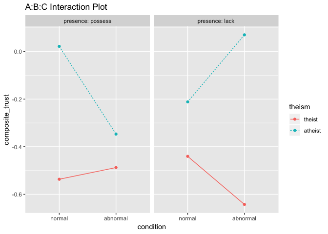

### Check assumptions for ANOVA

Shapiro-Wilk test is significant, but the key interaction remains using a robust test.

``` r
exp5_with_belief %$%
  leveneTest(
    composite_trust ~ condition * explained_belief * theism * presence
  )
```

|       |   Df|  F value|  Pr(&gt;F)|
|-------|----:|--------:|----------:|
| group |   15|    1.392|     0.1467|
|       |  445|         |           |

``` r
exp5_lm %>% residuals() %>% shapiro.test()
```

    ##
    ##  Shapiro-Wilk normality test
    ##
    ## data:  .
    ## W = 0.98, p-value = 4e-05

``` r
exp5_with_belief %$%
  t3way(composite_trust ~ condition * explained_belief * theism)
```

    ## Call:
    ## t3way(formula = composite_trust ~ condition * explained_belief *
    ##     theism)
    ##
    ##                                     value p.value
    ## condition                          0.2867   0.600
    ## explained_belief                   4.0328   0.046
    ## theism                            23.2930   0.001
    ## condition:explained_belief         2.7610   0.098
    ## condition:theism                   0.2649   0.608
    ## explained_belief:theism            0.3615   0.549
    ## condition:explained_belief:theism  7.6310   0.007

Scale Items
-----------

Reasonable reliability.

``` r
exp5_included %>%
  select(
    important, science_class, theology_class, accept, gov_funding, who_funded,
    replicated
  ) %>%
  psych::alpha(warnings = FALSE)
```

    ##
    ## Reliability analysis
    ## Call: psych::alpha(x = ., warnings = FALSE)
    ##
    ##   raw_alpha std.alpha G6(smc) average_r S/N   ase  mean   sd median_r
    ##       0.69      0.65    0.74      0.21 1.9 0.019 -0.33 0.94     0.37
    ##
    ##  lower alpha upper     95% confidence boundaries
    ## 0.66 0.69 0.73
    ##
    ##  Reliability if an item is dropped:
    ##                raw_alpha std.alpha G6(smc) average_r S/N alpha se var.r
    ## important           0.65      0.61    0.70      0.21 1.6    0.022 0.104
    ## science_class       0.58      0.53    0.63      0.16 1.1    0.026 0.090
    ## theology_class      0.61      0.56    0.66      0.17 1.3    0.024 0.103
    ## accept              0.58      0.52    0.64      0.15 1.1    0.026 0.105
    ## gov_funding         0.62      0.57    0.68      0.18 1.3    0.024 0.114
    ## who_funded          0.74      0.70    0.74      0.28 2.3    0.015 0.111
    ## replicated          0.75      0.74    0.76      0.32 2.8    0.015 0.077
    ##                 med.r
    ## important       0.078
    ## science_class   0.078
    ## theology_class  0.078
    ## accept         -0.019
    ## gov_funding     0.078
    ## who_funded      0.420
    ## replicated      0.420
    ##
    ##  Item statistics
    ##                  n raw.r std.r  r.cor r.drop   mean  sd
    ## important      539 0.620  0.58  0.491   0.43  0.852 1.6
    ## science_class  539 0.788  0.75  0.756   0.65  0.258 1.7
    ## theology_class 539 0.726  0.70  0.667   0.57  0.273 1.7
    ## accept         539 0.793  0.78  0.756   0.67  0.139 1.6
    ## gov_funding    539 0.716  0.68  0.607   0.53 -0.063 1.8
    ## who_funded     539 0.243  0.32  0.153   0.03 -1.677 1.4
    ## replicated     539 0.067  0.17 -0.019  -0.11 -2.087 1.1
    ##
    ## Non missing response frequency for each item
    ##                  -3   -2   -1    0    1    2    3 miss
    ## important      0.04 0.06 0.08 0.15 0.26 0.25 0.15    0
    ## science_class  0.09 0.11 0.12 0.17 0.24 0.21 0.07    0
    ## theology_class 0.09 0.10 0.12 0.20 0.24 0.21 0.06    0
    ## accept         0.08 0.12 0.11 0.25 0.24 0.17 0.05    0
    ## gov_funding    0.13 0.14 0.12 0.17 0.21 0.15 0.08    0
    ## who_funded     0.34 0.31 0.21 0.06 0.04 0.03 0.02    0
    ## replicated     0.46 0.31 0.13 0.06 0.01 0.01 0.01    0

### Single item analyses

``` r
exp5_with_belief %>%
  group_by(condition, explained_belief, theism) %>%
  select(
    important, science_class, theology_class, accept, gov_funding,
    who_funded, replicated
  ) %>%
  summarise_all(mean) %>%
  kable(
    col.names = c(
      "condition", "belief", "theism", "important", "sci. class", "theo. class",
      "accept", "gov. fund", "funder", "replicated"
    )
  )
```

| condition | belief  | theism  |  important|  sci. class|  theo. class|   accept|  gov. fund|  funder|  replicated|
|:----------|:--------|:--------|----------:|-----------:|------------:|--------:|----------:|-------:|-----------:|
| normal    | god     | theist  |     0.7288|      0.1356|       0.3390|   0.1525|    -0.5593|  -1.695|      -1.678|
| normal    | god     | atheist |     1.0962|      0.4808|       0.4615|   0.3654|     0.2308|  -1.712|      -2.346|
| normal    | atheism | theist  |     0.4545|      0.0182|       0.1455|  -0.2545|    -0.8000|  -1.709|      -2.291|
| normal    | atheism | atheist |     1.1304|      0.8913|       0.4783|   0.5217|     0.8261|  -1.630|      -2.130|
| abnormal  | god     | theist  |     0.5185|     -0.0741|       0.1296|  -0.0185|    -0.3704|  -1.889|      -2.093|
| abnormal  | god     | atheist |     1.6615|      1.0000|       0.7231|   0.7846|     0.6615|  -1.554|      -2.139|
| abnormal  | atheism | theist  |     0.4032|     -0.0806|      -0.0323|  -0.1129|    -0.5000|  -1.677|      -2.097|
| abnormal  | atheism | atheist |     0.7647|     -0.0441|      -0.0147|  -0.1176|     0.2206|  -1.779|      -2.162|

``` r
exp5_with_belief %$%
  ANOVA(lm(important ~ condition * explained_belief * theism * presence))
```

| term                                        |      sumsq|   df|  statistic|  p.value|  Partial eta^2|
|:--------------------------------------------|----------:|----:|----------:|--------:|--------------:|
| condition                                   |     0.1706|    1|     0.0695|   0.7922|         0.0000|
| explained\_belief                           |    11.0170|    1|     4.4851|   0.0347|         0.0136|
| theism                                      |    44.6803|    1|    18.1898|   0.0000|         0.0402|
| presence                                    |     0.6181|    1|     0.2516|   0.6162|         0.0003|
| condition:explained\_belief                 |     4.6072|    1|     1.8756|   0.1715|         0.0040|
| condition:theism                            |     1.8419|    1|     0.7498|   0.3870|         0.0012|
| explained\_belief:theism                    |     2.0234|    1|     0.8237|   0.3646|         0.0024|
| condition:presence                          |     0.0321|    1|     0.0131|   0.9090|         0.0000|
| explained\_belief:presence                  |     5.7559|    1|     2.3433|   0.1265|         0.0053|
| theism:presence                             |     0.4984|    1|     0.2029|   0.6526|         0.0001|
| condition:explained\_belief:theism          |     5.0497|    1|     2.0558|   0.1523|         0.0047|
| condition:explained\_belief:presence        |     0.3993|    1|     0.1626|   0.6870|         0.0004|
| condition:theism:presence                   |    17.8202|    1|     7.2548|   0.0073|         0.0160|
| explained\_belief:theism:presence           |     0.0276|    1|     0.0112|   0.9156|         0.0001|
| condition:explained\_belief:theism:presence |     0.7481|    1|     0.3046|   0.5813|         0.0007|
| Residuals                                   |  1093.0708|  445|           |         |               |

``` r
exp5_with_belief %$%
  ANOVA(lm(science_class ~ condition * explained_belief * theism * presence))
```

| term                                        |      sumsq|   df|  statistic|  p.value|  Partial eta^2|
|:--------------------------------------------|----------:|----:|----------:|--------:|--------------:|
| condition                                   |     2.4455|    1|     0.8776|   0.3494|         0.0022|
| explained\_belief                           |     5.0521|    1|     1.8129|   0.1788|         0.0068|
| theism                                      |    43.5158|    1|    15.6155|   0.0001|         0.0301|
| presence                                    |     7.2670|    1|     2.6077|   0.1071|         0.0042|
| condition:explained\_belief                 |    10.6758|    1|     3.8310|   0.0509|         0.0086|
| condition:theism                            |     0.3108|    1|     0.1115|   0.7386|         0.0004|
| explained\_belief:theism                    |     1.2294|    1|     0.4411|   0.5069|         0.0017|
| condition:presence                          |     8.6998|    1|     3.1219|   0.0779|         0.0069|
| explained\_belief:presence                  |     5.9838|    1|     2.1472|   0.1435|         0.0056|
| theism:presence                             |     4.8255|    1|     1.7316|   0.1889|         0.0046|
| condition:explained\_belief:theism          |    14.5431|    1|     5.2188|   0.0228|         0.0117|
| condition:explained\_belief:presence        |     2.1428|    1|     0.7689|   0.3810|         0.0017|
| condition:theism:presence                   |     2.9449|    1|     1.0568|   0.3045|         0.0024|
| explained\_belief:theism:presence           |     2.3543|    1|     0.8448|   0.3585|         0.0021|
| condition:explained\_belief:theism:presence |     0.4522|    1|     0.1623|   0.6873|         0.0004|
| Residuals                                   |  1240.0839|  445|           |         |               |

``` r
exp5_with_belief %$%
  ANOVA(lm(theology_class ~ condition * explained_belief * theism * presence))
```

| term                                        |      sumsq|   df|  statistic|  p.value|  Partial eta^2|
|:--------------------------------------------|----------:|----:|----------:|--------:|--------------:|
| condition                                   |     2.2851|    1|     0.8162|   0.3668|         0.0018|
| explained\_belief                           |     8.9271|    1|     3.1886|   0.0748|         0.0083|
| theism                                      |     8.4742|    1|     3.0269|   0.0826|         0.0066|
| presence                                    |     0.0022|    1|     0.0008|   0.9778|         0.0002|
| condition:explained\_belief                 |     3.0280|    1|     1.0816|   0.2989|         0.0026|
| condition:theism                            |     0.0619|    1|     0.0221|   0.8819|         0.0001|
| explained\_belief:theism                    |     0.7063|    1|     0.2523|   0.6157|         0.0008|
| condition:presence                          |     3.5265|    1|     1.2596|   0.2623|         0.0029|
| explained\_belief:presence                  |     0.4433|    1|     0.1583|   0.6909|         0.0003|
| theism:presence                             |     1.8614|    1|     0.6649|   0.4153|         0.0018|
| condition:explained\_belief:theism          |     3.4600|    1|     1.2359|   0.2669|         0.0026|
| condition:explained\_belief:presence        |     0.1371|    1|     0.0490|   0.8249|         0.0001|
| condition:theism:presence                   |     7.1047|    1|     2.5377|   0.1119|         0.0057|
| explained\_belief:theism:presence           |     0.0139|    1|     0.0050|   0.9438|         0.0001|
| condition:explained\_belief:theism:presence |     2.4172|    1|     0.8634|   0.3533|         0.0019|
| Residuals                                   |  1245.8478|  445|           |         |               |

``` r
exp5_with_belief %$%
  ANOVA(lm(accept ~ condition * explained_belief * theism * presence))
```

| term                                        |      sumsq|   df|  statistic|  p.value|  Partial eta^2|
|:--------------------------------------------|----------:|----:|----------:|--------:|--------------:|
| condition                                   |     0.2070|    1|     0.0879|   0.7670|         0.0002|
| explained\_belief                           |     9.8435|    1|     4.1775|   0.0416|         0.0132|
| theism                                      |    24.4837|    1|    10.3907|   0.0014|         0.0190|
| presence                                    |     0.6432|    1|     0.2730|   0.6016|         0.0014|
| condition:explained\_belief                 |     3.1912|    1|     1.3543|   0.2451|         0.0029|
| condition:theism                            |     0.0763|    1|     0.0324|   0.8573|         0.0004|
| explained\_belief:theism                    |     0.1842|    1|     0.0782|   0.7799|         0.0005|
| condition:presence                          |     2.2816|    1|     0.9683|   0.3256|         0.0020|
| explained\_belief:presence                  |    12.1811|    1|     5.1696|   0.0235|         0.0145|
| theism:presence                             |     2.4632|    1|     1.0454|   0.3071|         0.0037|
| condition:explained\_belief:theism          |     9.9122|    1|     4.2067|   0.0409|         0.0099|
| condition:explained\_belief:presence        |     6.2883|    1|     2.6687|   0.1030|         0.0060|
| condition:theism:presence                   |    10.1713|    1|     4.3166|   0.0383|         0.0095|
| explained\_belief:theism:presence           |     5.9768|    1|     2.5365|   0.1120|         0.0067|
| condition:explained\_belief:theism:presence |     6.0472|    1|     2.5664|   0.1099|         0.0057|
| Residuals                                   |  1048.5618|  445|           |         |               |

``` r
exp5_with_belief %$%
  ANOVA(lm(gov_funding ~ condition * explained_belief * theism * presence))
```

| term                                        |      sumsq|   df|  statistic|  p.value|  Partial eta^2|
|:--------------------------------------------|----------:|----:|----------:|--------:|--------------:|
| condition                                   |     0.5499|    1|     0.1796|   0.6719|         0.0006|
| explained\_belief                           |     0.2917|    1|     0.0953|   0.7577|         0.0009|
| theism                                      |   123.9891|    1|    40.5040|   0.0000|         0.0794|
| presence                                    |     0.1601|    1|     0.0523|   0.8192|         0.0000|
| condition:explained\_belief                 |     5.9055|    1|     1.9292|   0.1655|         0.0040|
| condition:theism                            |     1.9573|    1|     0.6394|   0.4244|         0.0024|
| explained\_belief:theism                    |     2.1400|    1|     0.6991|   0.4035|         0.0012|
| condition:presence                          |     0.2483|    1|     0.0811|   0.7759|         0.0001|
| explained\_belief:presence                  |     0.0002|    1|     0.0001|   0.9931|         0.0001|
| theism:presence                             |     0.0000|    1|     0.0000|   0.9988|         0.0001|
| condition:explained\_belief:theism          |     7.1177|    1|     2.3251|   0.1280|         0.0056|
| condition:explained\_belief:presence        |     0.7073|    1|     0.2310|   0.6310|         0.0005|
| condition:theism:presence                   |    10.2369|    1|     3.3441|   0.0681|         0.0073|
| explained\_belief:theism:presence           |     1.7763|    1|     0.5803|   0.4466|         0.0019|
| condition:explained\_belief:theism:presence |     8.8618|    1|     2.8949|   0.0896|         0.0065|
| Residuals                                   |  1362.2161|  445|           |         |               |

``` r
exp5_with_belief %$%
  ANOVA(lm(who_funded ~ condition * explained_belief * theism * presence))
```

| term                                        |     sumsq|   df|  statistic|  p.value|  Partial eta^2|
|:--------------------------------------------|---------:|----:|----------:|--------:|--------------:|
| condition                                   |    0.2037|    1|     0.1073|   0.7434|         0.0003|
| explained\_belief                           |    0.1811|    1|     0.0954|   0.7576|         0.0001|
| theism                                      |    1.0779|    1|     0.5677|   0.4516|         0.0005|
| presence                                    |    7.2877|    1|     3.8385|   0.0507|         0.0083|
| condition:explained\_belief                 |    0.0000|    1|     0.0000|   0.9975|         0.0000|
| condition:theism                            |    0.7166|    1|     0.3775|   0.5393|         0.0005|
| explained\_belief:theism                    |    0.6248|    1|     0.3291|   0.5665|         0.0011|
| condition:presence                          |    0.0766|    1|     0.0404|   0.8409|         0.0001|
| explained\_belief:presence                  |    0.0013|    1|     0.0007|   0.9792|         0.0001|
| theism:presence                             |    0.0491|    1|     0.0259|   0.8723|         0.0001|
| condition:explained\_belief:theism          |    2.3024|    1|     1.2127|   0.2714|         0.0030|
| condition:explained\_belief:presence        |    0.4238|    1|     0.2232|   0.6368|         0.0005|
| condition:theism:presence                   |    0.2788|    1|     0.1469|   0.7017|         0.0004|
| explained\_belief:theism:presence           |   11.7319|    1|     6.1793|   0.0133|         0.0154|
| condition:explained\_belief:theism:presence |    5.5237|    1|     2.9094|   0.0888|         0.0065|
| Residuals                                   |  844.8674|  445|           |         |               |

``` r
exp5_with_belief %$%
  ANOVA(lm(replicated ~ condition * explained_belief * theism * presence))
```

| term                                        |     sumsq|   df|  statistic|  p.value|  Partial eta^2|
|:--------------------------------------------|---------:|----:|----------:|--------:|--------------:|
| condition                                   |    0.0645|    1|     0.0552|   0.8143|         0.0000|
| explained\_belief                           |    1.1673|    1|     0.9987|   0.3182|         0.0022|
| theism                                      |    2.5792|    1|     2.2067|   0.1381|         0.0060|
| presence                                    |    3.1558|    1|     2.7000|   0.1011|         0.0058|
| condition:explained\_belief                 |    1.0811|    1|     0.9250|   0.3367|         0.0021|
| condition:theism                            |    1.5102|    1|     1.2921|   0.2563|         0.0030|
| explained\_belief:theism                    |    4.9298|    1|     4.2178|   0.0406|         0.0075|
| condition:presence                          |    0.8403|    1|     0.7189|   0.3970|         0.0016|
| explained\_belief:presence                  |    0.2185|    1|     0.1870|   0.6657|         0.0004|
| theism:presence                             |    0.0115|    1|     0.0098|   0.9212|         0.0000|
| condition:explained\_belief:theism          |    5.1991|    1|     4.4482|   0.0355|         0.0098|
| condition:explained\_belief:presence        |    0.0000|    1|     0.0000|   0.9958|         0.0000|
| condition:theism:presence                   |    0.4171|    1|     0.3569|   0.5505|         0.0008|
| explained\_belief:theism:presence           |    3.2108|    1|     2.7471|   0.0981|         0.0060|
| condition:explained\_belief:theism:presence |    0.0841|    1|     0.0720|   0.7886|         0.0002|
| Residuals                                   |  520.1200|  445|           |         |               |

Supplementary Experiment
========================

Load data.

``` r
sup_raw <-
  read_csv("data/supplementary_data.csv")
sup_data <-
  sup_raw %>%
  select(
    participant_id = ResponseId,
    consent = Q1,
    you_should = Q16, you_would = Q14,
    michael_should = Q15, michael_would = Q100,
    plausible = Q97, attention_check = Q13_9_TEXT, done_before = Q106,
    sex = Q81, age = Q82,
    valence = AcceptReject, domain = SciRelMor, prevalence = CommonRare,
    discipline = PsychBrain, condition = NormalAbnormal,
    own_belief = TargetRating
  ) %>%
  # Drop extra header rows.
  slice(-1:-2) %>%
  type_convert() %>%
  # Center Likerts at 0.
  mutate_at(
    vars(contains("should"), contains("would"), own_belief),
    funs(. - 4)
  ) %>%
  mutate(
    consent = consent %>%
      recode_factor("2" = "consent", "1" = "no_consent"),
    done_before = done_before %>%
      recode_factor("1" = "yes", "2" = "maybe", "3" = "no"),
    sex = sex %>%
      recode_factor("1" = "male", "2" = "female", "3" = "other"),
    domain = domain %>%
      recode_factor("1" = "scientific", "2" = "religious", "3" = "moral"),
    prevalence = prevalence %>%
      recode_factor("1" = "common", "2" = "rare"),
    condition = condition %>%
      recode_factor("Normal" = "neutral", "Abnormal" = "implied_abnormality"),
    discipline = discipline %>%
      recode_factor("Brain" = "neuroscience", "Psych" = "cognitive"),
    valence = valence %>%
      recode_factor("1" = "accept", "2" = "reject"),
    pass_check = grepl("dax", attention_check, ignore.case = TRUE),
    agrees_with_michael = ((valence == "accept" & own_belief > 0)
                           | (valence == "reject" & own_belief < 0))
  ) %>%
  mutate_at(
    vars(contains("michael_")),
    funs(. * if_else(valence == "accept", 1, -1))
  ) %>%
  mutate_at(
    vars(contains("you_")),
    funs(. * if_else(own_belief > 0, 1, -1))
  )
```

Participants
------------

4 participants didn't complete the experiment. Another 15 participants think they might have done a similar study before. 5 of the rest missed a catch question. Analyses will focus on data from the remaining 160 participants.

``` r
sup_data %>%
  # Don't count leaving attention check blank as not finishing, just as wrong.
  select(-attention_check) %>%
  filter(consent == "consent") %>%
  count(complete.cases(.), done_before == "no", pass_check)
sup_included <-
  sup_data %>%
  drop_na() %>%
  filter(consent == "consent", done_before == "no", pass_check)
```

| complete.cases(.) | done\_before == "no" | pass\_check |    n|
|:------------------|:---------------------|:------------|----:|
| FALSE             | NA                   | FALSE       |    4|
| TRUE              | FALSE                | FALSE       |    1|
| TRUE              | FALSE                | TRUE        |   14|
| TRUE              | TRUE                 | FALSE       |    5|
| TRUE              | TRUE                 | TRUE        |  160|

### Demographics

``` r
sup_included %>% select(sex, age) %>% summary() %>% kable()
```

|     |    sex    |      age     |
|-----|:---------:|:------------:|
|     |  male :88 |  Min. :18.0  |
|     | female:72 | 1st Qu.:23.8 |
|     |           | Median :27.0 |
|     |           |  Mean :31.0  |
|     |           | 3rd Qu.:34.0 |
|     |           |  Max. :74.0  |

### Inclusion/exclusion by conditions

``` r
sup_included %>% count(condition, discipline, prevalence, valence)
```

| condition            | discipline   | prevalence | valence |    n|
|:---------------------|:-------------|:-----------|:--------|----:|
| neutral              | neuroscience | common     | accept  |   12|
| neutral              | neuroscience | common     | reject  |    8|
| neutral              | neuroscience | rare       | accept  |   10|
| neutral              | neuroscience | rare       | reject  |   10|
| neutral              | cognitive    | common     | accept  |    9|
| neutral              | cognitive    | common     | reject  |    8|
| neutral              | cognitive    | rare       | accept  |   10|
| neutral              | cognitive    | rare       | reject  |    9|
| implied\_abnormality | neuroscience | common     | accept  |   11|
| implied\_abnormality | neuroscience | common     | reject  |   11|
| implied\_abnormality | neuroscience | rare       | accept  |   10|
| implied\_abnormality | neuroscience | rare       | reject  |    9|
| implied\_abnormality | cognitive    | common     | accept  |   10|
| implied\_abnormality | cognitive    | common     | reject  |   11|
| implied\_abnormality | cognitive    | rare       | accept  |   11|
| implied\_abnormality | cognitive    | rare       | reject  |   11|

Distribution and Means
----------------------

``` r
sup_included %>%
  vio_dot("michael_should", "condition", "discipline") +
  facet_grid(. ~ valence)
```

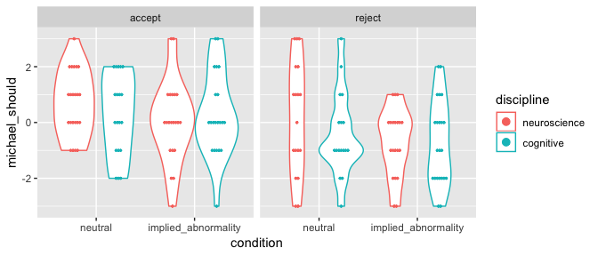

``` r
sup_included %>%
  vio_dot("michael_would", "condition", "discipline") +
  facet_grid(. ~ valence)
```

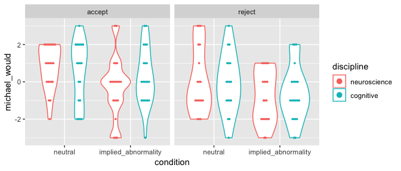

### Group means

Many between-subjects factors, but the effect of implied abnormality is in the predicted direction across all but one (cognitive explanation for accepting a common belief): association with a mechanism that is implied to be functioning abnormally produces less reinforcement (more undermining). Also a clear effect of valence, with more belief reinforcement suggested for positive, rather than negative beliefs.

``` r
sup_included %>%
  group_by(condition, discipline, prevalence, valence) %>%
  summarise(mean(michael_should), mean(michael_would))
```

| condition            | discipline   | prevalence | valence |  mean(michael\_should)|  mean(michael\_would)|
|:---------------------|:-------------|:-----------|:--------|----------------------:|---------------------:|
| neutral              | neuroscience | common     | accept  |                 0.5000|                0.5833|
| neutral              | neuroscience | common     | reject  |                -0.3750|                0.0000|
| neutral              | neuroscience | rare       | accept  |                 0.9000|                1.1000|
| neutral              | neuroscience | rare       | reject  |                 0.6000|                0.2000|
| neutral              | cognitive    | common     | accept  |                 0.2222|                0.2222|
| neutral              | cognitive    | common     | reject  |                -0.6250|               -0.1250|
| neutral              | cognitive    | rare       | accept  |                 0.3000|                0.7000|
| neutral              | cognitive    | rare       | reject  |                -0.2222|                0.0000|
| implied\_abnormality | neuroscience | common     | accept  |                 0.0000|               -0.7273|
| implied\_abnormality | neuroscience | common     | reject  |                -0.9091|               -0.8182|
| implied\_abnormality | neuroscience | rare       | accept  |                 0.1000|                0.2000|
| implied\_abnormality | neuroscience | rare       | reject  |                -0.4444|               -0.7778|
| implied\_abnormality | cognitive    | common     | accept  |                 0.5000|                0.6000|
| implied\_abnormality | cognitive    | common     | reject  |                -1.0909|               -1.0909|
| implied\_abnormality | cognitive    | rare       | accept  |                 0.0909|                0.0000|
| implied\_abnormality | cognitive    | rare       | reject  |                -0.3636|               -0.1818|

Direction of the effect is consistent across belief domains as well.

``` r
sup_included %>%
  group_by(condition, domain) %>%
  summarise(mean(michael_should), mean(michael_would))
```

| condition            | domain     |  mean(michael\_should)|  mean(michael\_would)|
|:---------------------|:-----------|----------------------:|---------------------:|
| neutral              | scientific |                -0.2333|                0.0000|
| neutral              | religious  |                 0.6087|                0.6522|
| neutral              | moral      |                 0.3913|                0.5652|
| implied\_abnormality | scientific |                -0.5000|               -0.4643|
| implied\_abnormality | religious  |                -0.0345|               -0.4483|
| implied\_abnormality | moral      |                -0.2963|               -0.1481|

Plot for Paper
--------------

``` r
sup_included %>%
  paper_plot(
    y = "michael_should",
    x = "valence", x_lab = "Belief Valence",
    color = "condition", color_lab = "Mechanism Type",
    ylim = c(-1, 1), dodge = 0.25
  ) +
  # Remove underscore from "implied_abnormality" condition name.
  scale_color_grey(
    name = "Mechanism Type",
    labels = c(
      neutral = "Neutral",
      implied_abnormality = "Implied Abnormality"
    )
  )
```

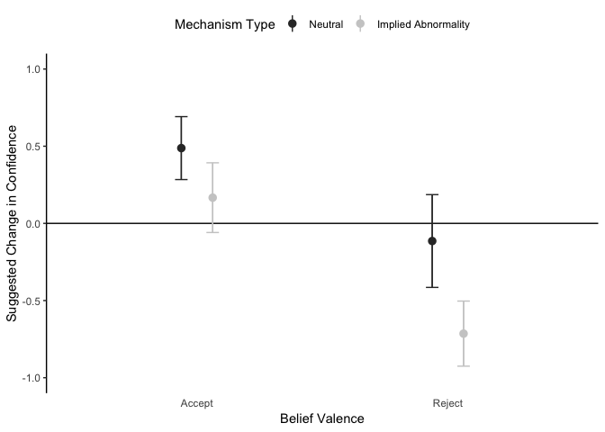

ANOVAs
------

Marginal evidence for a main effect of mechanism type (for normative/"should" judgments, significant evidence for such an effect for predictive/"would" judgments). The main effect of valence (with more reinforcement advised for all positive beliefs) is significant.

``` r
sup_should_lm <-
  sup_included %$%
  lm(michael_should ~ condition * discipline * prevalence * valence)
ANOVA(sup_should_lm)
```

| term                                    |     sumsq|   df|  statistic|  p.value|  Partial eta^2|
|:----------------------------------------|---------:|----:|----------:|--------:|--------------:|
| condition                               |    7.2027|    1|     3.1996|   0.0758|         0.0218|
| discipline                              |    1.5013|    1|     0.6669|   0.4155|         0.0042|
| prevalence                              |    4.6254|    1|     2.0547|   0.1539|         0.0135|
| valence                                 |   22.5283|    1|    10.0077|   0.0019|         0.0660|
| condition:discipline                    |    3.3772|    1|     1.5002|   0.2226|         0.0106|
| condition:prevalence                    |    0.5836|    1|     0.2593|   0.6114|         0.0018|
| discipline:prevalence                   |    0.8029|    1|     0.3567|   0.5513|         0.0023|
| condition:valence                       |    0.5620|    1|     0.2497|   0.6181|         0.0016|
| discipline:valence                      |    0.3814|    1|     0.1694|   0.6812|         0.0013|
| prevalence:valence                      |    3.5559|    1|     1.5796|   0.2108|         0.0115|
| condition:discipline:prevalence         |    0.2590|    1|     0.1151|   0.7350|         0.0007|
| condition:discipline:valence            |    0.0974|    1|     0.0433|   0.8355|         0.0003|
| condition:prevalence:valence            |    0.2228|    1|     0.0990|   0.7535|         0.0007|
| discipline:prevalence:valence           |    0.1679|    1|     0.0746|   0.7852|         0.0006|
| condition:discipline:prevalence:valence |    0.6439|    1|     0.2860|   0.5936|         0.0020|
| Residuals                               |  324.1561|  144|           |         |               |

``` r
sup_included %$% t.test(michael_should ~ condition, alternative = "greater")
```

    ##
    ##  Welch Two Sample t-test
    ##
    ## data:  michael_should by condition
    ## t = 2, df = 150, p-value = 0.02
    ## alternative hypothesis: true difference in means is greater than 0
    ## 95 percent confidence interval:
    ##  0.08595     Inf
    ## sample estimates:
    ##             mean in group neutral mean in group implied_abnormality
    ##                            0.2105                           -0.2738

The same effects are seen for predictive judgments, except that there is significant--rather than marginal--evidence for an effect of mechanism type.

``` r
sup_would_lm <-
  sup_included %$%
  lm(michael_would ~ condition * discipline * prevalence * valence)
ANOVA(sup_would_lm)
```

| term                                    |     sumsq|   df|  statistic|  p.value|  Partial eta^2|
|:----------------------------------------|---------:|----:|----------:|--------:|--------------:|
| condition                               |   18.4999|    1|     7.7471|   0.0061|         0.0532|
| discipline                              |    0.0819|    1|     0.0343|   0.8533|         0.0003|
| prevalence                              |    4.1576|    1|     1.7411|   0.1891|         0.0130|
| valence                                 |   18.4692|    1|     7.7343|   0.0061|         0.0509|
| condition:discipline                    |    3.9689|    1|     1.6620|   0.1994|         0.0122|
| condition:prevalence                    |    0.0011|    1|     0.0005|   0.9827|         0.0000|
| discipline:prevalence                   |    0.3681|    1|     0.1541|   0.6952|         0.0012|
| condition:valence                       |    0.1041|    1|     0.0436|   0.8349|         0.0002|
| discipline:valence                      |    0.0835|    1|     0.0350|   0.8519|         0.0005|
| prevalence:valence                      |    0.0014|    1|     0.0006|   0.9809|         0.0000|
| condition:discipline:prevalence         |    0.1830|    1|     0.0766|   0.7823|         0.0008|
| condition:discipline:valence            |    0.9487|    1|     0.3973|   0.5295|         0.0027|
| condition:prevalence:valence            |    1.0291|    1|     0.4310|   0.5126|         0.0029|
| discipline:prevalence:valence           |    3.4350|    1|     1.4385|   0.2324|         0.0111|
| condition:discipline:prevalence:valence |    3.6485|    1|     1.5279|   0.2184|         0.0105|
| Residuals                               |  343.8664|  144|           |         |               |

### Check assumptions for ANOVAs

``` r
sup_included %$%
  leveneTest(michael_would ~ condition * discipline * prevalence * valence)
```

|       |   Df|  F value|  Pr(&gt;F)|
|-------|----:|--------:|----------:|
| group |   15|   0.7985|     0.6778|
|       |  144|         |           |

``` r
sup_included %$%
  leveneTest(michael_should ~ condition * discipline * prevalence * valence)
```

|       |   Df|  F value|  Pr(&gt;F)|
|-------|----:|--------:|----------:|
| group |   15|   0.5538|     0.9051|
|       |  144|         |           |

``` r
residuals(sup_should_lm) %>% shapiro.test()
```

    ##
    ##  Shapiro-Wilk normality test
    ##
    ## data:  .
    ## W = 1, p-value = 0.9

``` r
residuals(sup_would_lm) %>% shapiro.test()
```

    ##
    ##  Shapiro-Wilk normality test
    ##
    ## data:  .
    ## W = 0.99, p-value = 0.3

Belief Reinforcement/Undermining
--------------------------------

Looking at things separately for "accept" and "reject" conditions because of the main effect of valence. In the accept condition, neutral explanations support belief reinforcement, but explanations that imply an abnormal mechanism do not. In the reject condition, everything shifts downward, with neutral explanations near the scale midpoint and implied abnormality explanations taken to support belief undermining.

``` r
sup_included %>%
  group_by(condition, valence) %>%
  summarise(
    michael_should = mean(michael_should),
    michael_would = mean(michael_would)
  )
```

| condition            | valence |  michael\_should|  michael\_would|
|:---------------------|:--------|----------------:|---------------:|
| neutral              | accept  |           0.4878|          0.6585|
| neutral              | reject  |          -0.1143|          0.0286|
| implied\_abnormality | accept  |           0.1667|          0.0000|
| implied\_abnormality | reject  |          -0.7143|         -0.7143|

Tests against the scale midpoint confirm significant reinforcement for {accept, neutral} and undermining for {reject, implied abnormality}, with the other two conditions not significantly different from the scale midpoint.

``` r
sup_included %>%
  group_by(condition, valence) %>%
  do(tidy(t.test(.$michael_should))) %>%
  select(-c(method, alternative))
```

| condition            | valence |  estimate|  statistic|  p.value|  parameter|  conf.low|  conf.high|
|:---------------------|:--------|---------:|----------:|--------:|----------:|---------:|----------:|
| neutral              | accept  |    0.4878|     2.3913|   0.0216|         40|    0.0755|     0.9001|
| neutral              | reject  |   -0.1143|    -0.3802|   0.7062|         34|   -0.7252|     0.4966|
| implied\_abnormality | accept  |    0.1667|     0.7380|   0.4647|         41|   -0.2894|     0.6228|
| implied\_abnormality | reject  |   -0.7143|    -3.3873|   0.0016|         41|   -1.1401|    -0.2884|

``` r
sup_included %>%
  group_by(condition, valence) %>%
  do(tidy(t.test(.$michael_would))) %>%
  select(-c(method, alternative))
```

| condition            | valence |  estimate|  statistic|  p.value|  parameter|  conf.low|  conf.high|
|:---------------------|:--------|---------:|----------:|--------:|----------:|---------:|----------:|
| neutral              | accept  |    0.6585|     2.9592|   0.0052|         40|    0.2088|     1.1083|
| neutral              | reject  |    0.0286|     0.1011|   0.9200|         34|   -0.5455|     0.6027|
| implied\_abnormality | accept  |    0.0000|     0.0000|   1.0000|         41|   -0.4963|     0.4963|
| implied\_abnormality | reject  |   -0.7143|    -3.2619|   0.0022|         41|   -1.1565|    -0.2721|

First-Person Judgments
----------------------

Exclude participants who were neutral about explained belief in analyzing "you" data. Use the remaining 141 participants.

``` r
sup_with_belief <-
  sup_included %>%
  filter(own_belief != 0) %>%
  mutate(
    own_opposing = agrees_with_michael %>%
      parse_factor(levels = c("TRUE", "FALSE")) %>%
      fct_recode(own = "TRUE", opposing = "FALSE")
  ) %>%
  droplevels()
nrow(sup_with_belief)
```

    ## [1] 141

``` r
sup_with_belief %>% count(condition, valence, discipline, own_opposing)
```

| condition            | valence | discipline   | own\_opposing |    n|
|:---------------------|:--------|:-------------|:--------------|----:|
| neutral              | accept  | neuroscience | own           |   13|
| neutral              | accept  | neuroscience | opposing      |    5|
| neutral              | accept  | cognitive    | own           |   13|
| neutral              | accept  | cognitive    | opposing      |    4|
| neutral              | reject  | neuroscience | own           |    6|
| neutral              | reject  | neuroscience | opposing      |   12|
| neutral              | reject  | cognitive    | own           |    3|
| neutral              | reject  | cognitive    | opposing      |   10|
| implied\_abnormality | accept  | neuroscience | own           |   15|
| implied\_abnormality | accept  | neuroscience | opposing      |    3|
| implied\_abnormality | accept  | cognitive    | own           |   10|
| implied\_abnormality | accept  | cognitive    | opposing      |    8|
| implied\_abnormality | reject  | neuroscience | own           |    6|
| implied\_abnormality | reject  | neuroscience | opposing      |   13|
| implied\_abnormality | reject  | cognitive    | own           |   10|
| implied\_abnormality | reject  | cognitive    | opposing      |   10|

### First-person distribution and means

``` r
sup_with_belief %>%
  vio_dot("you_would", "condition", "own_opposing")
```

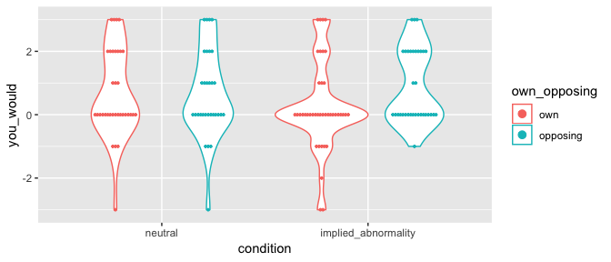

``` r
sup_with_belief %>%
  vio_dot("you_should", "condition", "own_opposing")
```

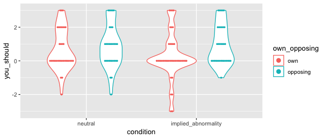

Explanations that appeal to neutral mechanisms are received about equally by all participants. But, participants whose belief is opposite the explained belief think that their own belief is *more* reinforced by explanations for the target belief that imply an abnormally functioning mechanism, whereas participants who share the target belief think that their belief is *less* reinforced (more undermined) if the explanation for it implies an abnormal mechanism. (This is consistent with the first-person results from Experiment 3.)

``` r
sup_with_belief %$%
  tapply(you_would, list(condition, own_opposing), mean) %>% kable()
```

|                      |     own|  opposing|
|----------------------|-------:|---------:|
| neutral              |  0.6571|    0.6452|
| implied\_abnormality |  0.2439|    0.8824|

``` r
sup_with_belief %$%
  tapply(you_should, list(condition, own_opposing), mean) %>% kable()
```

|                      |     own|  opposing|
|----------------------|-------:|---------:|
| neutral              |  0.6571|    0.8710|
| implied\_abnormality |  0.2683|    0.9706|

### First-person ANOVAs

Marginal evidence of the interaction described above. Also a significant interaction between explanation discipline and participants' belief, which appears to reflect that people also find neuroscientific explanations for their own beliefs less reinforcing (regardless of implied abnormality).

``` r
sup_you_would_lm <-
  sup_with_belief %$%
  lm(you_would ~ condition * discipline * own_opposing * valence)
ANOVA(sup_you_would_lm)
```

| term                                       |     sumsq|   df|  statistic|  p.value|  Partial eta^2|
|:-------------------------------------------|---------:|----:|----------:|--------:|--------------:|
| condition                                  |    0.1234|    1|     0.0691|   0.7932|         0.0020|
| discipline                                 |    2.0010|    1|     1.1200|   0.2920|         0.0135|
| own\_opposing                              |    1.8617|    1|     1.0420|   0.3093|         0.0080|
| valence                                    |    0.3522|    1|     0.1971|   0.6578|         0.0005|
| condition:discipline                       |    1.0530|    1|     0.5894|   0.4441|         0.0009|
| condition:own\_opposing                    |    6.3782|    1|     3.5700|   0.0611|         0.0257|
| discipline:own\_opposing                   |    8.2493|    1|     4.6173|   0.0336|         0.0369|
| condition:valence                          |    1.7672|    1|     0.9891|   0.3219|         0.0062|
| discipline:valence                         |    4.7402|    1|     2.6531|   0.1059|         0.0170|
| own\_opposing:valence                      |    0.1847|    1|     0.1034|   0.7484|         0.0020|
| condition:discipline:own\_opposing         |    2.5734|    1|     1.4404|   0.2323|         0.0107|
| condition:discipline:valence               |    0.7309|    1|     0.4091|   0.5236|         0.0040|
| condition:own\_opposing:valence            |    0.0152|    1|     0.0085|   0.9267|         0.0001|
| discipline:own\_opposing:valence           |    0.0150|    1|     0.0084|   0.9272|         0.0002|
| condition:discipline:own\_opposing:valence |    1.4398|    1|     0.8059|   0.3711|         0.0064|
| Residuals                                  |  223.3276|  125|           |         |               |

``` r
sup_with_belief %>%
  ggplot(
    aes(x = own_opposing, y = you_would,
        group = condition, color = condition)
  ) +
  geom_line(stat = "summary", fun.y = "mean")
```

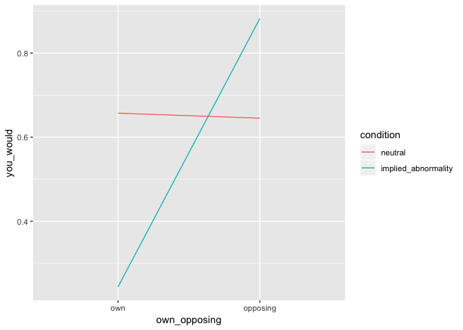

``` r
sup_with_belief %>%
  ggplot(
    aes(x = own_opposing, y = you_would,
        group = discipline, color = discipline)
  ) +
  geom_line(stat = "summary", fun.y = "mean")
```

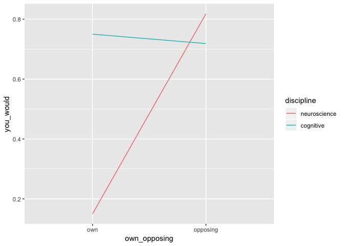

The same effects are seen for normative judgments.

``` r
sup_you_should_lm <-
  sup_with_belief %$%
  lm(you_should ~ condition * discipline * own_opposing * valence)
ANOVA(sup_you_should_lm)
```

| term                                       |     sumsq|   df|  statistic|  p.value|  Partial eta^2|
|:-------------------------------------------|---------:|----:|----------:|--------:|--------------:|
| condition                                  |    0.2400|    1|     0.1509|   0.6983|         0.0042|
| discipline                                 |    1.3124|    1|     0.8253|   0.3654|         0.0101|
| own\_opposing                              |    3.3631|    1|     2.1150|   0.1484|         0.0186|
| valence                                    |    1.1298|    1|     0.7105|   0.4009|         0.0034|
| condition:discipline                       |    0.4859|    1|     0.3056|   0.5814|         0.0000|
| condition:own\_opposing                    |    5.0920|    1|     3.2022|   0.0760|         0.0218|
| discipline:own\_opposing                   |   13.4863|    1|     8.4810|   0.0043|         0.0628|
| condition:valence                          |    2.5547|    1|     1.6065|   0.2073|         0.0100|
| discipline:valence                         |    1.8961|    1|     1.1924|   0.2770|         0.0073|
| own\_opposing:valence                      |    1.0599|    1|     0.6665|   0.4158|         0.0088|
| condition:discipline:own\_opposing         |    1.0089|    1|     0.6345|   0.4272|         0.0044|
| condition:discipline:valence               |    0.0651|    1|     0.0410|   0.8400|         0.0007|
| condition:own\_opposing:valence            |    0.0686|    1|     0.0431|   0.8358|         0.0004|
| discipline:own\_opposing:valence           |    0.0215|    1|     0.0135|   0.9076|         0.0000|
| condition:discipline:own\_opposing:valence |    2.3379|    1|     1.4702|   0.2276|         0.0116|
| Residuals                                  |  198.7712|  125|           |         |               |

#### Check assumptions for first-person ANOVAs

Mean looks to be a good measure, but effects are weaker with trimmed means.

``` r
sup_with_belief %$%
  leveneTest(you_would ~ condition * discipline * own_opposing * valence)
```

|       |   Df|  F value|  Pr(&gt;F)|
|-------|----:|--------:|----------:|
| group |   15|   0.1831|     0.9997|
|       |  125|         |           |

``` r
sup_with_belief %$%
  leveneTest(you_should ~ condition * discipline * own_opposing * valence)
```

|       |   Df|  F value|  Pr(&gt;F)|
|-------|----:|--------:|----------:|
| group |   15|    0.457|     0.9572|
|       |  125|         |           |

``` r
residuals(sup_you_would_lm) %>% shapiro.test()
```

    ##
    ##  Shapiro-Wilk normality test
    ##
    ## data:  .
    ## W = 0.97, p-value = 0.003

``` r
residuals(sup_you_should_lm) %>% shapiro.test()
```

    ##
    ##  Shapiro-Wilk normality test
    ##
    ## data:  .
    ## W = 0.97, p-value = 0.01

``` r
sup_with_belief %$%
  t3way(you_would ~ condition * discipline * own_opposing)
```

    ## Call:
    ## t3way(formula = you_would ~ condition * discipline * own_opposing)
    ##
    ##                                    value p.value
    ## condition                         0.2944   0.590
    ## discipline                        1.0868   0.310
    ## own_opposing                      1.3391   0.252
    ## condition:discipline              0.5170   0.475
    ## condition:own_opposing            1.6102   0.209
    ## discipline:own_opposing           2.4892   0.120
    ## condition:discipline:own_opposing 0.7198   0.400

``` r
sup_with_belief %$%
  t3way(you_would ~ condition * discipline * own_opposing)
```

    ## Call:
    ## t3way(formula = you_would ~ condition * discipline * own_opposing)
    ##
    ##                                    value p.value
    ## condition                         0.2944   0.590
    ## discipline                        1.0868   0.310
    ## own_opposing                      1.3391   0.252
    ## condition:discipline              0.5170   0.475
    ## condition:own_opposing            1.6102   0.209
    ## discipline:own_opposing           2.4892   0.120
    ## condition:discipline:own_opposing 0.7198   0.400
